---
lab:
    title: 'Lab 1 - Provision SQL Server on an Azure Virtual Machine'
    module: 'Deploy IaaS resources with Azure SQL'
---

# Provision a SQL Server on an Azure Virtual Machine

**Estimated Time: 30 minutes**

Students will explore the Azure Portal and use it to create an Azure VM with SQL Server 2019 installed. Then they will connect to the virtual machine through Remote Desktop Protocol and restore a database using SQL Server Management Studio.

The students will:

- Interact with the Azure portal

- Create a SQL Server Virtual Machine

- Use SQL Server Management Studio to restore a database

You are a database administrator for AdventureWorks. You need to create a test environment for use in a proof of concept. The proof of concept will use SQL Server on an Azure Virtual Machine and a backup of the AdventureWorksDW database. You need to set up the Virtual Machine, restore the database, and query it to ensure it is available.

## Explore the Azure Portal

1. From the lab virtual machine, start a browser session and navigate to [https://portal.azure.com](https://portal.azure.com/).

    

1. In the Azure Portal, type subscription in the search bar at the top of the screen. Click on the **Subscriptions** icon. (You may need to log in first.)

    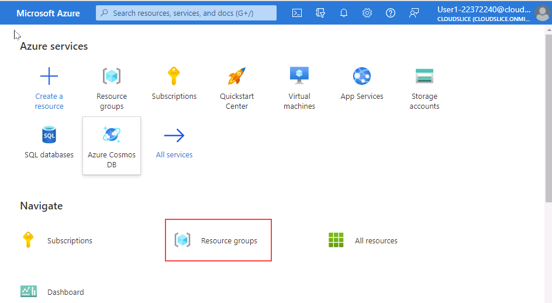

1. On the **Subscriptions** blade, click on the subscription available. Review your Subscription name, subscription ID, and your role. (You may have a different subscription name)

    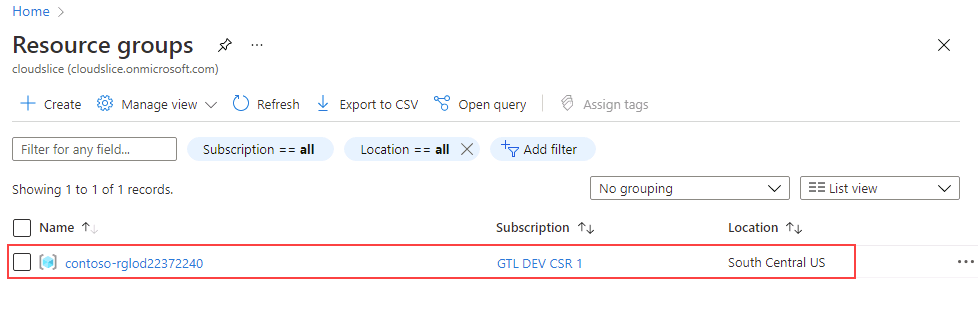

1. Launch the left navigation pane by clicking the horizontal lines next to Microsoft Azure in the top left of the portal. Then select **All resources**. The **All resources** page will list all Azure resources within your selected subscriptions.

    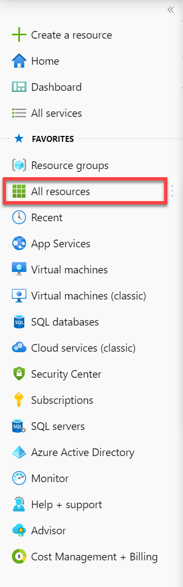

1. Select **Resource groups** in the left navigation. The **Resource groups** blade will list all Azure resource groups within your selected subscriptions.

    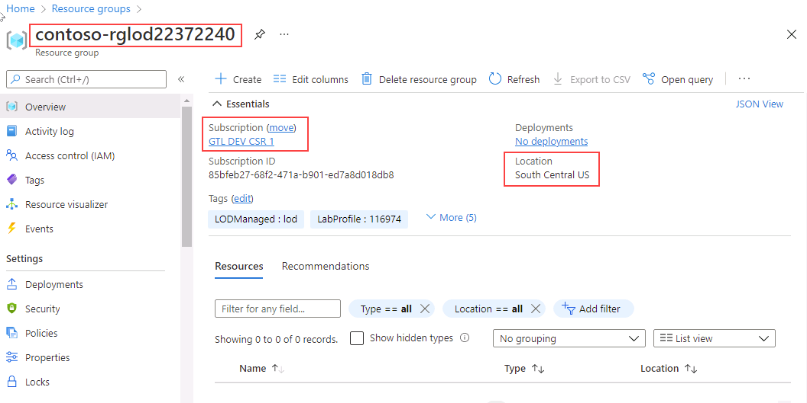

1. On the **Resource groups** blade, review the **Location** property. (You may have a different location assigned)

    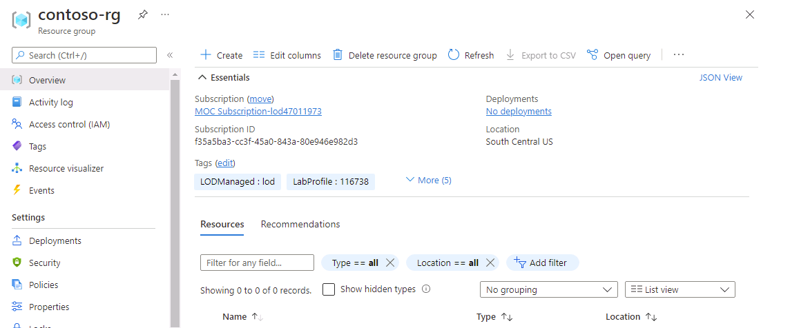

1. Locate the search bar at the top of the page. Search for **Azure SQL**. Select the search result for **Azure SQL** that appears in the results under **Services**.

    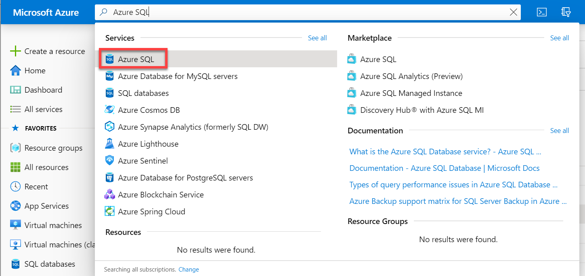

## Provision a SQL Server on an Azure Virtual Machine

1. On the **Azure SQL** blade, select **Create**.

    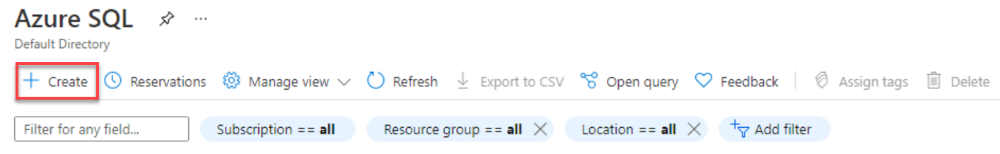

1. On the **Select SQL deployment option** blade, click on the drop-down box under **SQL virtual machines**. Select the option labeled Free SQL Server License: SQL 2019 Developer on Windows Server 2019. Then select **Create**.

    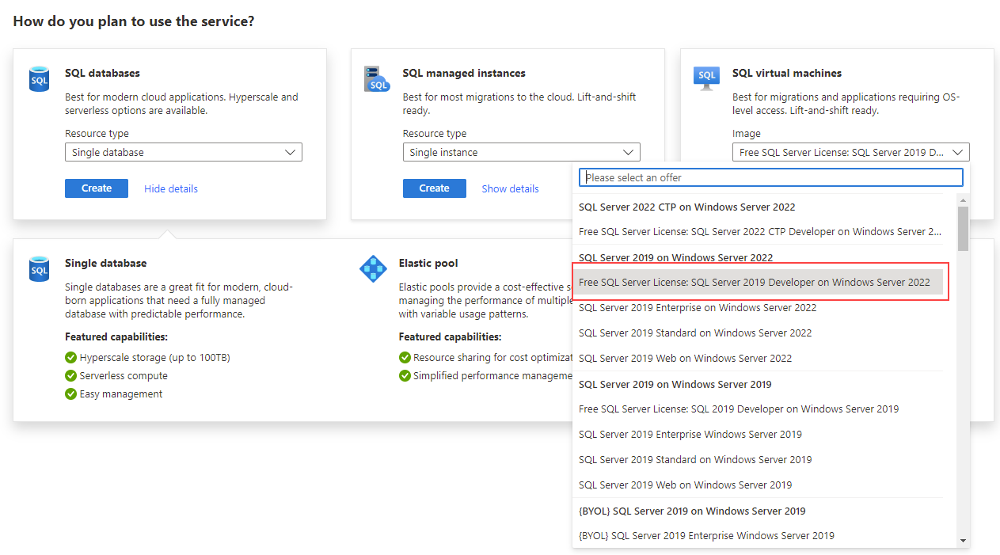

1. On the Create a virtual machine blade, enter the following information:

    - Subscription: **&lt;Your subscription&gt;**
    - Resource group: **DP-300-Lab01**
    - Virtual machine name:  **dp300sqlvmlab01**
    - Region: **&lt;your local region, same as the selected region for your resource group&gt;**
    - Availability Options: **No infrastructure redundancy required**
    - Image: **Free SQL Server License: SQL 2019 Developer on Windows Server 2019 - Gen1**
    - Azure spot instance: **No**
    - Size: Standard **D2s_v3** (2 vCPUs, 8 GiB memory; you may need to select the "See all sizes" link to see this option)
    - Administrator account username: **dp300sqlvmlab01admin**
    - Administrator account password: **pwd!DP300lab01** (or your own password that meets the criteria)
    - Select inbound ports: **RDP (3389)**
    - Would you like to use an existing Windows Server license?: **No**

    Make note of the username and password for later use.

    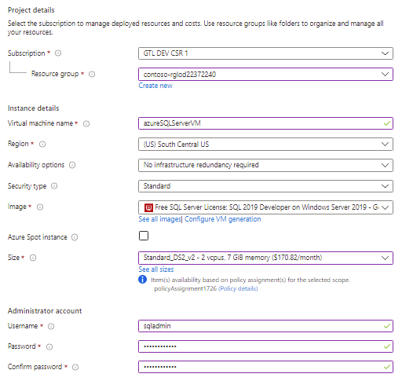

1. Navigate to the Disks tab and review the configuration.

    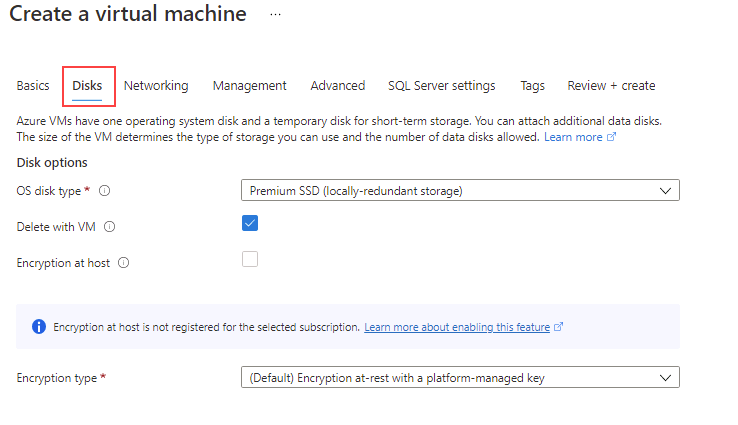

1. Navigate to the Networking tab and review the configuration.

    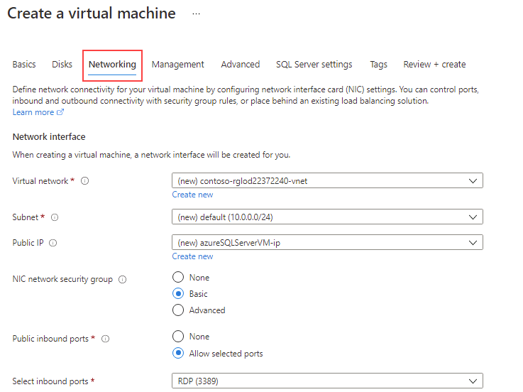

1. Navigate to the Management tab and review the configuration.

    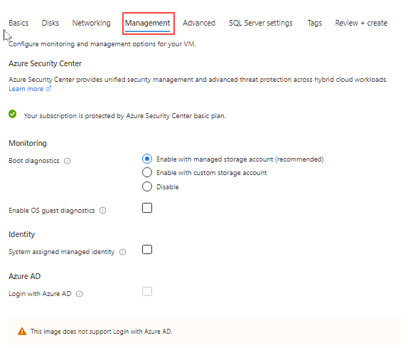

    Make sure that **Boot diagnostics** has the button for **Enable with managed storage account (recommended)** selected.
    Verify that **Enable auto_shutdown** is off.

1. Navigate to the Advanced tab and review the configuration.

    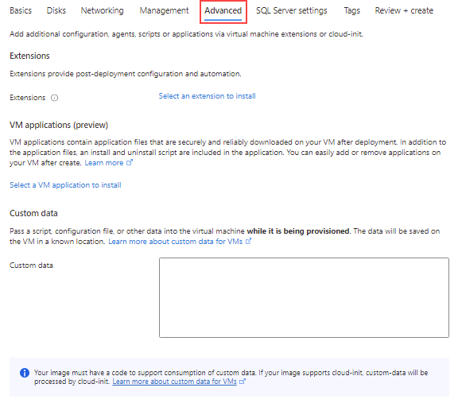

1. Navigate to the SQL Server settings tab and review the configuration.

    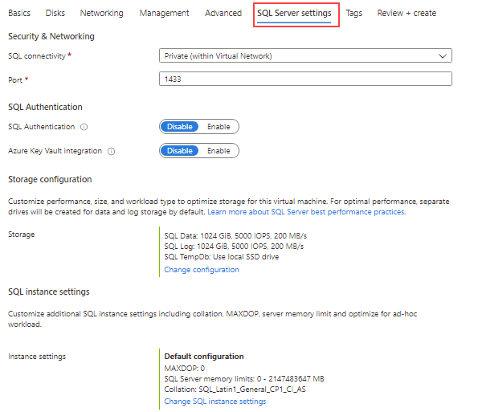

    Note—you can also configure the storage for your SQL Server VM on this screen. By default, the SQL Server Azure VM templates create one premium disk with read caching for data, one premium disk without caching for transaction log, and uses the local SSD (D:\ on Windows) for tempdb.

1. Select the Review + create button. Then select the Create button.  
    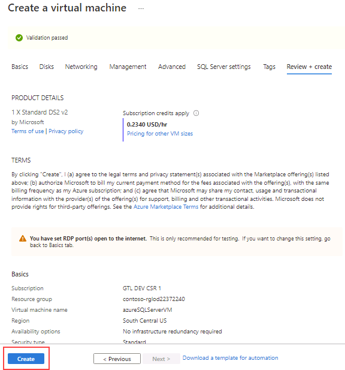

1. On the deployment blade, wait until the deployment is complete. The VM will take approximate 5-10 minutes to deploy. Then select the Go to resource button. 

    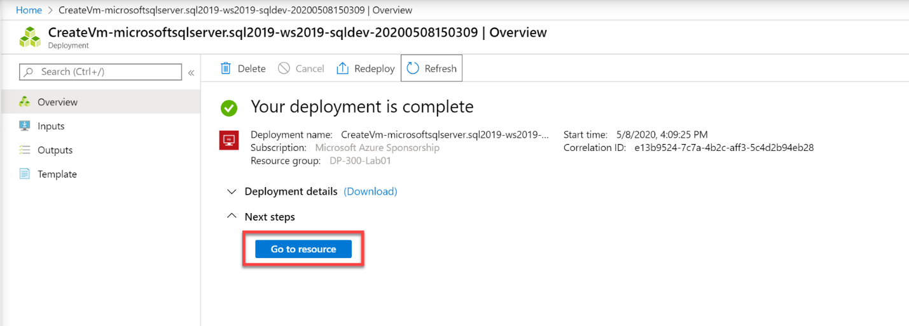

1. On the overview page for the virtual machine, scroll through the menu options for the resource to review what is available.

    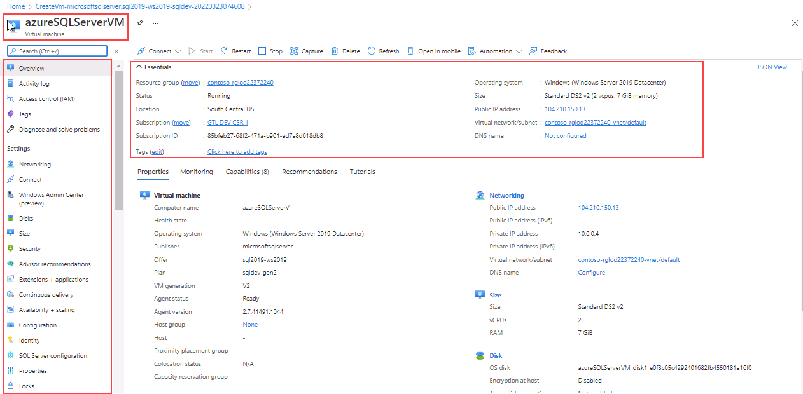

## Connect to SQL Server on an Azure Virtual Machine

1. On the Overview page for the virtual machine, select the Connect button and choose RDP.

    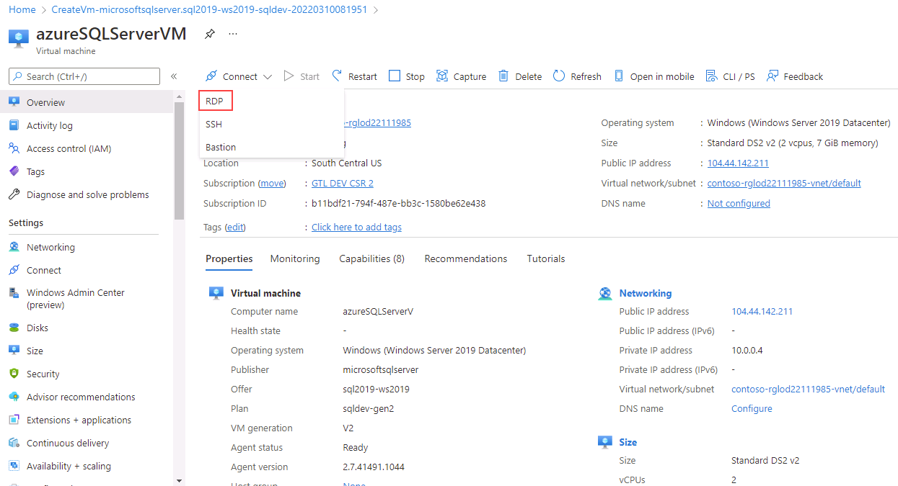

1. On the RDP tab, select the Download RDP File button.

    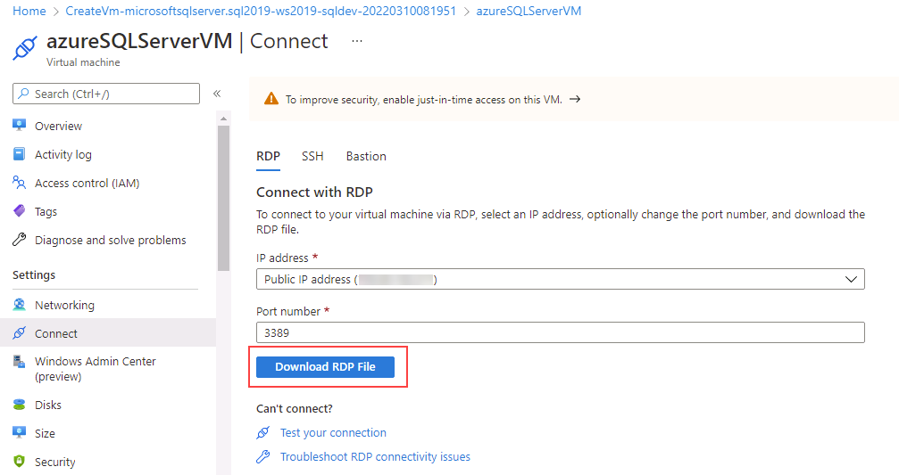

1. Open the RDP file that was just downloaded. When a dialog appears asking if you want to connect, select the Connect button.

    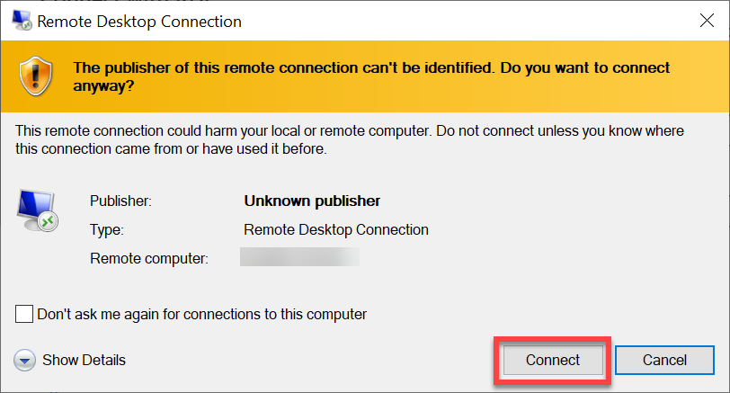

1. In the Windows Security dialog if you receive the PIN dialog, select More choices. Then choose Use a different account. If you don’t receive the PIN dialog, you can proceed to Step 5.

    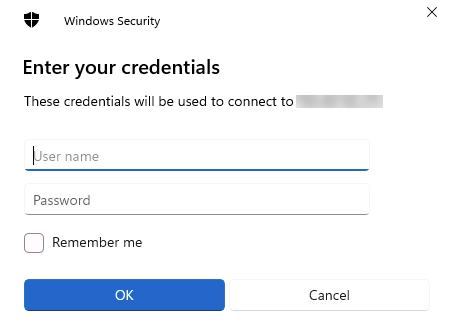

1. Enter the username and password selected during the virtual machine provisioning process. Then select the OK button.

    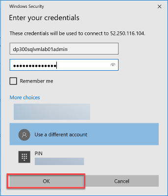

1. When the Remote Desktop Connection dialog appears asking if you want to connect, select the Yes button.

    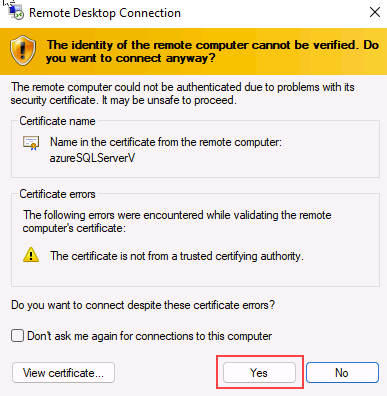

1. A Remote Desktop window will open. On the right, select the No button to indicate you do not want the computer to be discoverable by other devices on the network. Close the small Server Manager popup dialog by clicking the X in the top right of the box. Keep the big Server Manager Window open.

    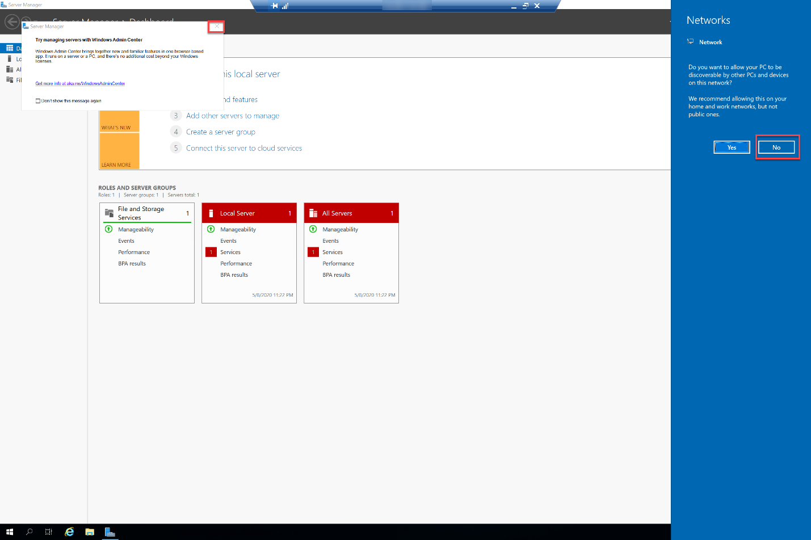

1. In the Server Manager window, select Local Server on the left and then select On next to IE Enhanced Security Configuration.

    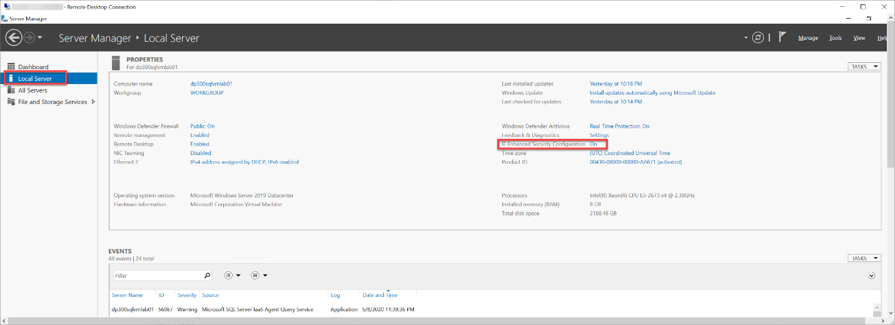

1. When the Internet Explorer Enhanced Security Configuration dialog appears, set Administrators to Off. Then select the OK button.

    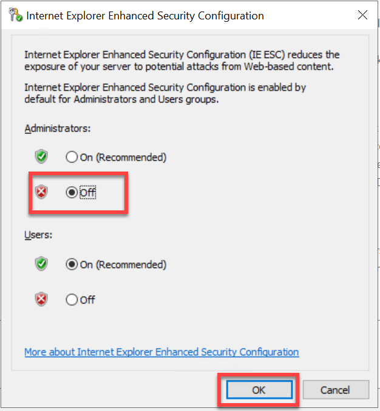

1. Select the Windows Start button and type SSMS. Select **Microsoft SQL Server Management Studio 18** from the list.  

    

1. When Management Studio opens, the Connect to Server dialog will be pre-populated to the local machine. Select the Connect button. 

    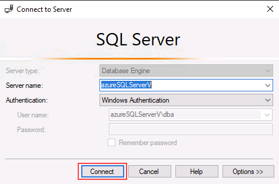

The Azure portal gives you powerful tools to manage a SQL Server hosted in a virtual machine. These tools include control over automated patching, automated backups, and giving you an easy way to setup high availability.

To finish this exercise select **Done** below.
