# Provision a SQL Server on an Azure Virtual Machine

Students will explore the Azure Portal and use it to create an Azure VM with SQL Server 2019 installed. Then they will connect to the virtual machine through Remote Desktop Protocol.

You are a database administrator for AdventureWorks. You need to create a test environment for use in a proof of concept. The proof of concept will use SQL Server on an Azure Virtual Machine and a backup of the AdventureWorksDW database. You need to set up the Virtual Machine, restore the database, and query it to ensure it is available.

## Deploy a SQL Server on an Azure Virtual Machine

1. On the Azure portal locate the search bar at the top of the page. Search for **Azure SQL**. Select the search result for **Azure SQL** that appears in the results under **Services**.

    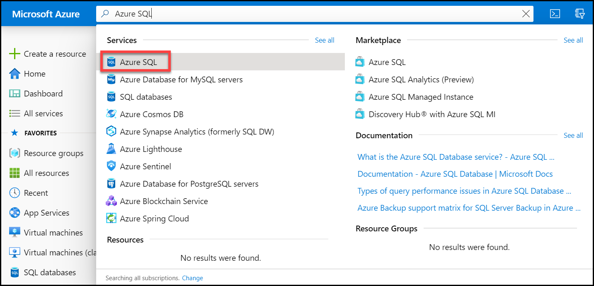

1. On the **Azure SQL** blade, select **Create**.

    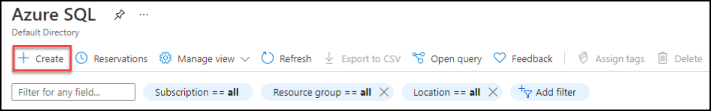

1. On the **Select SQL deployment option** blade, click on the drop-down box under **SQL virtual machines(1)**. Select the option labeled **Free SQL Server License: SQL 2019 Developer on Windows Server 2022(2)**. Then select **Create**.

    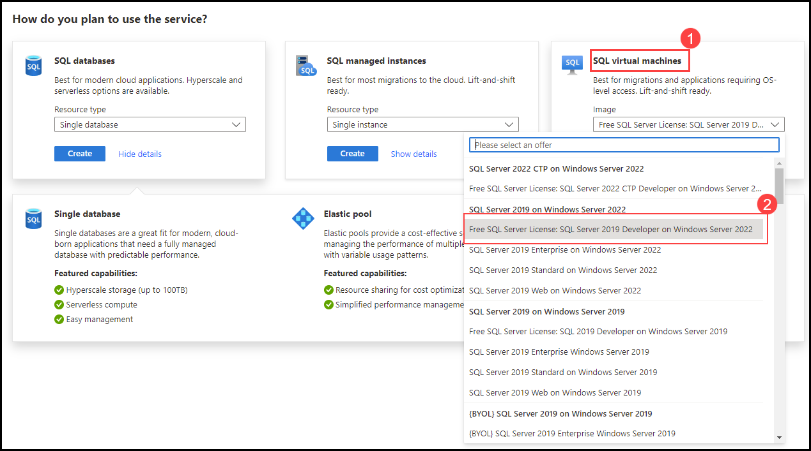

1. On the **Create a virtual machine** page, enter the following information:

    - **Subscription:** Use existing subscription 
    - **Resource group:** contoso-rg-<inject key="Deployment-id" enableCopy="false" />
    - **Virtual machine name:**  azureSQLServerVM
    - **Region:** <inject key="location" enableCopy="false" />
    - **Availability Options:** No infrastructure redundancy required
    - **Image:** Free SQL Server License: SQL 2019 Developer on Windows Server 2022 - Gen1
    - **Azure spot instance:** No (unchecked)
    - **Size:** Standard *D2s_v3* (2 vCPUs, 8 GiB memory). You may need to select the **"See all sizes"** link to see this option)
    - **Administrator account username:** sqladmin
    - **Administrator account password:** pwd!DP300lab01
    - **Select inbound ports:** RDP (3389)
    - **Would you like to use an existing Windows Server license?:** No (unchecked)

    Make note of the username and password for later use.

    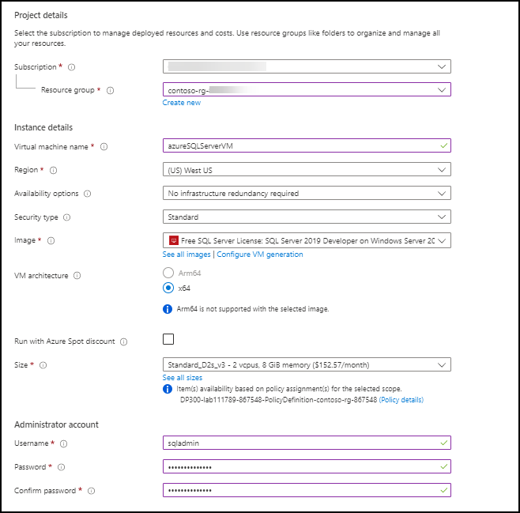

1. Navigate to the **Disks** tab and review the configuration.

    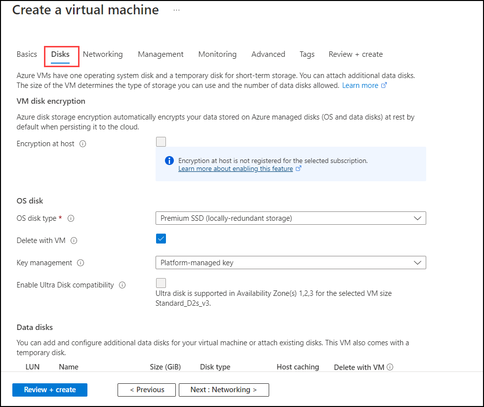

1. Navigate to the **Networking** tab and review the configuration.

    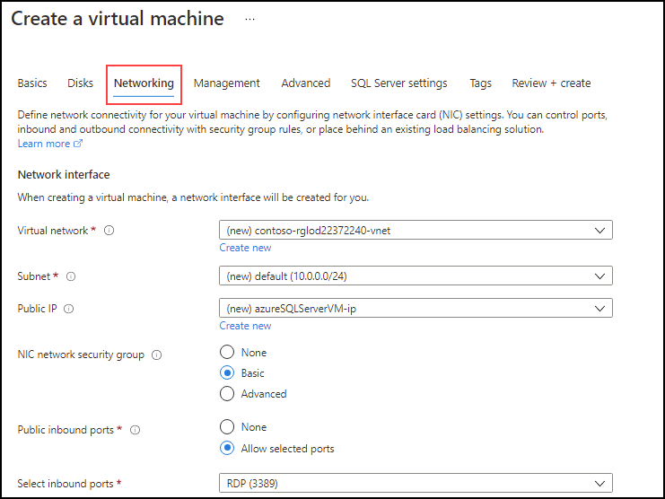

1. Navigate to the **Management** tab and review the configuration and Verify that **Enable auto_shutdown** is unchecked.

    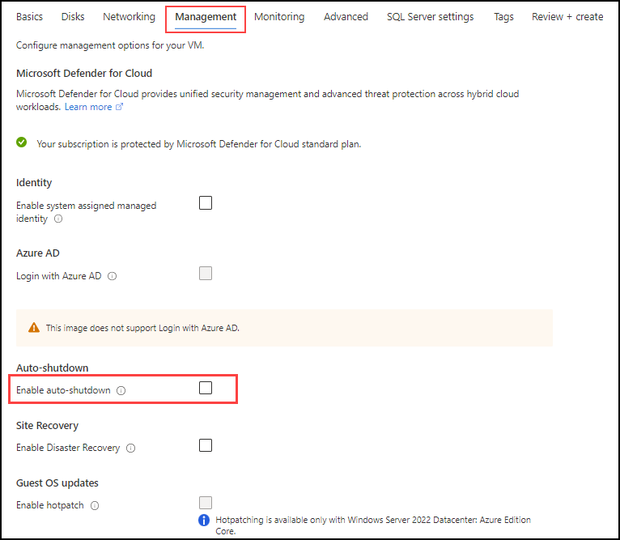

1. Navigate to the **Advanced** tab and review the configuration.

    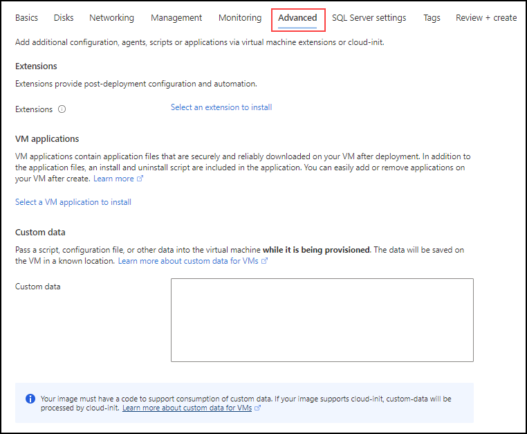

1. Navigate to the **SQL Server settings** tab and review the configuration.

    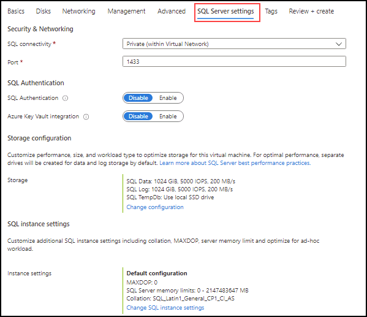

    >**Note**: you can also configure the storage for your SQL Server VM on this screen. By default, the SQL Server Azure VM templates create one premium disk with read caching for data, one premium disk without caching for transaction log, and uses the local SSD (D:\ on Windows) for tempdb.

1. Select the **Review + create** button. Then select **Create**.

    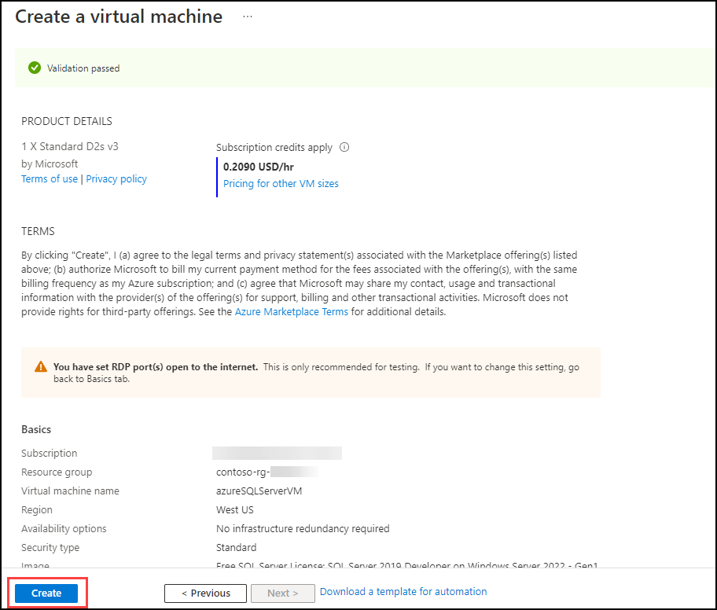

1. On the deployment blade, wait until the deployment is complete. The VM will take approximate 5-10 minutes to deploy. After the deployment is complete, select  **Go to resource**.

    >**Note:** Your deployment may take 5-10 minutes to complete.

    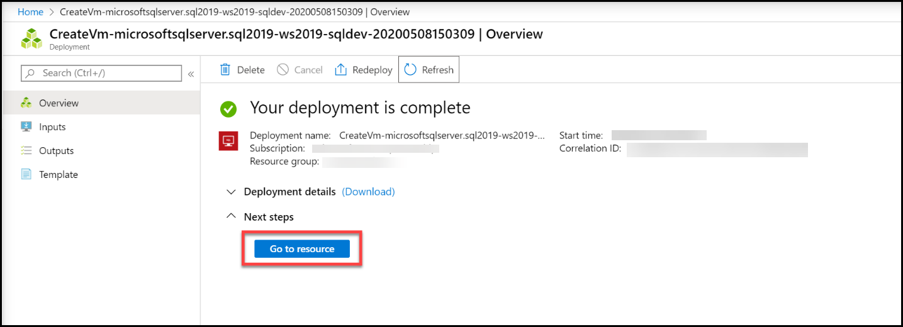
    
 1. On the **Overview** page for the virtual machine, explore the menu options for this resource to review what is available.

    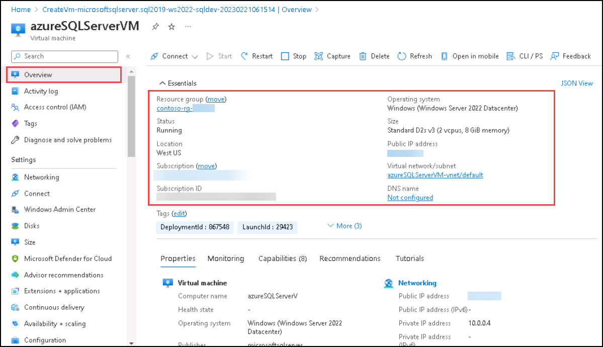
    
    > **Congratulations!** You have successfully completed this task. Please validate your progress by clicking on (...) icon from upper right corner of lab guide  section and switch to Lab Validation tab and then click on Validate button for the respective task.

## Connect to SQL Server on an Azure Virtual Machine

1. On the **Overview** page for the virtual machine, select the **Connect** button and choose RDP.

    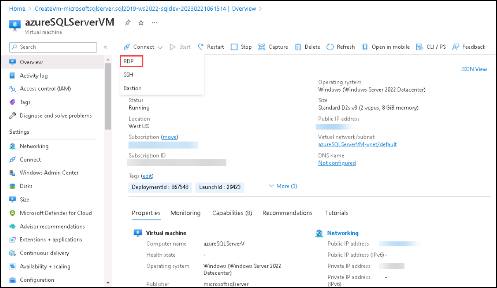

1. On the RDP tab, select the **Download RDP File** button.

    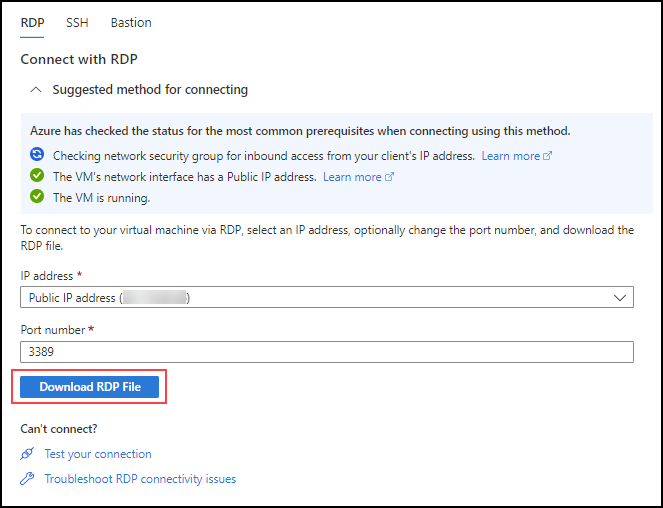

    >**Note**: If you see the error **Port prerequisite not met**. Make sure to select the link to add an inbound network security group rule with the destination port mentioned in the *Port number* field.

    

1. Open the RDP file that was just downloaded. When a dialog appears asking if you want to connect, select **Connect**.

    

1. Enter the username and password selected during the virtual machine provisioning process. Then select **OK**.

    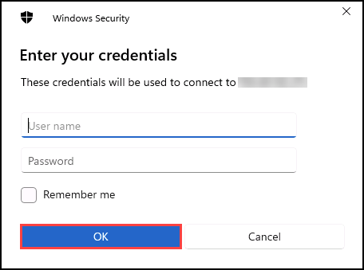

1. When the **Remote Desktop Connection** dialog appears asking if you want to connect, select **Yes**.

    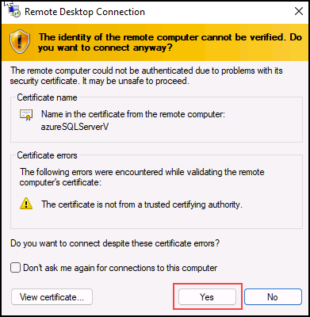

1. Inside the Virtual Machine, Select the Windows Start button and type **SSMS(1)**. Select **Microsoft SQL Server Management Studio 19(2)** from the list.  

   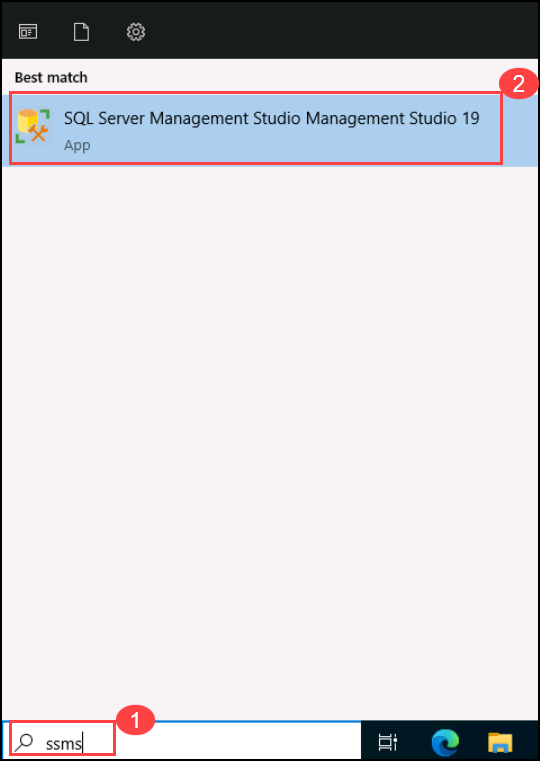

1. When SSMS opens, notice that the **Connect to Server** dialog will be pre-populated with the default instance name. Select **Connect**.

    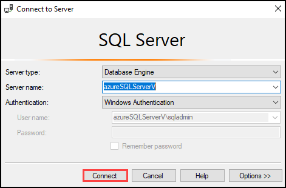

The Azure portal gives you powerful tools to manage a SQL Server hosted in a virtual machine. These tools include control over automated patching, automated backups, and giving you an easy way to setup high availability.
