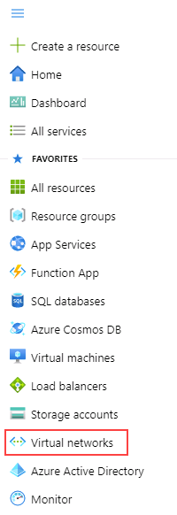
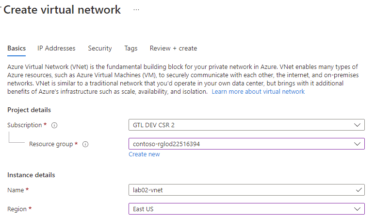
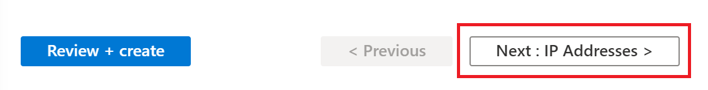
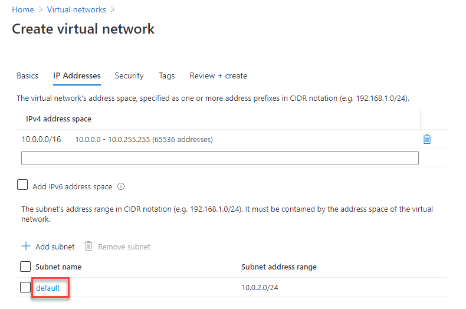
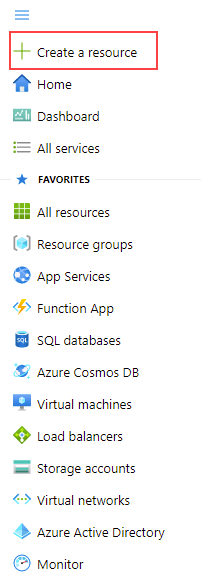

---
lab:
    title: 'Lab 2 - Provision an Azure SQL Database'
    module: 'Plan and Implement Data Platform Resources'
---

# Provision an Azure SQL Database

**Estimated Time: 40 minutes**

Students will configure basic resources needed to deploy an Azure SQL Database with a Virtual Network Endpoint. Connectivity to the SQL Database will be validated using Azure Data Studio from the lab VM.

As a database administrator for AdventureWorks, you will set up a new SQL Database, including a Virtual Network Endpoint to increase and simplify the security of the deployment. Azure Data Studio will be used to evaluate the use of a SQL Notebook for data querying and results retention.

## Create a Virtual Network

1. In the left navigation pane, click **Virtual Networks**  

    

1. Click **+ Create** to open the **Create Virtual Network** page. On the **Basics** tab, complete the following information:

    - **Subscription:** &lt;Your subscription&gt;
    - **Resource group:** starting with *contoso-rg*
    - **Name:** lab02-vnet
    - **Region:** Select the same region where your resource group was created

    

1. Click **Next: IP Addresses**.  

    

1. Configure the virtual network’s IP range for the Azure SQL database endpoint as follow:

    - On the IP Addresses tab, leave the defaults for the IPv4 address.
    - Click on the **default** subnet link. Note that the Subnet address range you see might be different.

        

    - In the **Edit subnet** pane on the right, expand the **Services** drop-down, and select **Microsoft.Sql**. Select **Save**.
    - Click the **Review + Create** button, review the settings for the new virtual network, and then click **Create**

## Provision an Azure SQL Database

1. From the Azure Portal, click on **+ Create a Resource** at the top of the left side navigation bar.

    

1. Search for “SQL databases” in the search box at the top, then click **SQL Databases** from the list of options.

    

1. Click the **Create** button

1. On the **Create SQL Database** page, select the following options on the **Basics** tab and then click **Next: Networking**.

    - **Subscription:** &lt;Your subscription&gt;
    - **Resource group:** starting with *contoso-rg*
    - **Database Name:** AdventureWorksLT
    - **Server:** click on **Create new** link. The **Create SQL Database Server** page will open. Provide the server details as follow:
        - **Server name:** dp300-lab-&lt;your initials (lower case)&gt; (server name must be globally unique)
        - **Location:** &lt;your local region, same as the selected region for your resource group&gt;
        - **Server admin login:** dp300admin
        - **Password:** dp300P@ssword!
        - **Confirm password:** dp300P@ssword!

        Your **Create SQL Database Server** page should look similar to the one below. Then click **OK**.

        

    -  Back to the **Create SQL Database** page, make sure **Want to use Elastic Pool?** is set to **No**.
    -  On the **Compute + Storage** option, click on **Configure database** link. On the **Configure** page, for **Service tier** dropdown, select **Basic**, and then **Apply**.

**Note: Make note of this server name, and your login information. You will use it in subsequent labs.**

1. For the **Backup storage redundancy** option, keep the default value: **Geo-redundant backup storage**.

1. Then click **Next: Networking**.

1. On the **Networking** tab, for **Network Connectivity** option, click the **Private endpoint** radio button.

    

1. Then click the **+ Add private endpoint** link under the **Private endpoints** option.

	

1. Complete the **Create private endpoint** right pane as follows:

    - **Subscription:** &lt;Your subscription&gt;
    - **Resource group:** starting with *contoso-rg*
    - **Location:** &lt;your local region, same as the selected region for your resource group&gt;
    - **Name:** DP-300-SQL-Endpoint
    - **Target sub-resource:** SqlServer
    - **Virtual network:** lab02-vnet
    - **Subnet:** default (10.x.0.0/24)
    - The Private DNS integration options can remain at the default
    - Review settings, and then click **OK**  

	

10. Confirm the endpoint appears on the Networking page. 

	

11. Click the **Next: Security** button, and then **Next: Additional settings** button.  

12. On the Additional Settings page, select the following options:

	- Set Use existing data to **Sample**

	

13. Click **Review + Create**

14. Review the settings before clicking **Create**

15. Once the deployment is complete, click the **Go to resource** button  


## Task 2: Enable All Azure Services access to new SQL Server

1. From the SQL Database blade, click on the link for the Server name in the top section  

	

2. On the SQL Server object’s navigation blade, click **Firewalls and virtual networks** under **Security**

	

3. Set **Allow Azure services and resources to access this server** to **Yes**  

	

4. Click **Save**, and then click **OK** on the Success message pane.

# Exercise 3: Connect to Azure SQL Database

## Task 1: Register Azure SQL Database Instance in Azure Data Studio

1. Launch Azure Data Studio (ADS) from the lab VM

	- You may see this pop-up at initial launch of Azure Data Studio. If you receive it, click **Yes**  


2. When Azure Data Studio opens, click the **Connections** button in Azure Data Studio’s left sidebar, then the **Add Connection** button
	
	

3. In the **Connections** sidebar, fill out the Connection Details section with connection information to connect to the SQL database created in the previous Exercise

	- Connection Type: **Microsoft SQL Server**

	- Server: Enter the name of the SQL Server created in Exercise 2, Task 1. For example: **dp300-lab-xx.database.windows.net**  
	[Note that you were asked to create a server name with your initials, instead of ‘xx’]

	- Authentication Type: **SQL Login**

	- User name: **dp300admin**

	- Password: **dp300P@ssword!**

	- Expand the Database drop-down to select **AdventureWorksLT.** 
	    - **NOTE:** You may be asked to add a firewall rule that allows your client IP access to this server. If you are asked to add a firewall rule, click on **Add account** and login to your Azure account. On Create new firewall screen rule screen, click **OK**.
		
	    
	    
    Back on the Connection sidebar, continue filling out the connection details:  
	
	- Server group will remain on **&lt;default&gt;**

	- Name (optional) can be populated with a friendly name of the database, if desired

	- Review settings and click **Connect**  

	

4. Azure Data Studio will connect to the database and show some basic information about the database, plus a partial list of objects  

	

## Task 2: Query Azure SQL Database with a SQL Notebook

1. In Azure Data Studio, connected to this lab’s AdventureWorksLT database, click the **New Notebook** button  

	

2. Click the **+Text** button to add a new text box in the notebook  

	


**Note:** Within the notebook you can embed plain text to explain queries or result sets.

3. Enter the text **Top Ten Customers by Order SubTotal**, making it Bold if desired  

	

4. Click the **+ Code** button to add a new cell at the end of the notebook to put a query in  

	

5. Paste the following SQL statement into the new cell

```sql
select top 10 cust.[CustomerID], cust.[CompanyName], sum(sohead.[SubTotal]) as OverallOrderSubTotal

  from [SalesLT].[Customer] cust

    inner join [SalesLT].[SalesOrderHeader] sohead

        on sohead.[CustomerID] = cust.[CustomerID]

   group by cust.[CustomerID], cust.[CompanyName]

   order by [OverallOrderSubTotal] desc
   ```

6. Click on the blue circle with the arrow to execute the query. Note how the results are included within the cell with the query.

7. Click the **+ Text** button to add a new text cell.

8. Enter the text **Top Ten Ordered Product Categories**, making it Bold if desired

9. Click the **+ Code** button again to add a new cell, and paste the following SQL statement into the cell

```sql
select top 10 cat.[Name] as ProductCategory, sum(detail.[OrderQty]) as OrderedQuantity

	from salesLT.[ProductCategory] cat

	   inner join saleslt.[Product] prod
      
	      on prod.[ProductCategoryID] = cat.[ProductCategoryID]

	   inner join salesLT.[SalesOrderDetail] detail

	      on detail.[ProductID] = prod.[ProductID]

	group by cat.[name]

	order by [OrderedQuantity] desc
```
10.  Click on the blue circle with the arrow to execute the query 

11. To run all cells in the notebook and present results, click the **Run Cells** button in the toolbar  

	

12. Within Azure Data Studio save the notebook from File menu (either Save or Save As) to the D:\Labfiles\Deploy Azure SQL Database (this folder already exists on the VM) directory. Close the tab for the Notebook from inside of Azure Data Studio. From the File Menu, select Open File, and open the notebook you just saved. Observe that query results were saved along with the queries in the notebook.
