# Configure database authentication and authorization

The students will take the information gained in the lessons to configure and subsequently implement security in the Azure Portal and within the *AdventureWorks* database.

You've been hired as a Senior Database Administrator to help ensure the security of the database environment.

>**Note:** These exercises ask you to copy and paste T-SQL code. Please verify that the code has been copied correctly, before executing the code.

## Authorize access to Azure SQL Database with Azure Active Directory
 
1. On the Azure portal home page select **All resources**.

   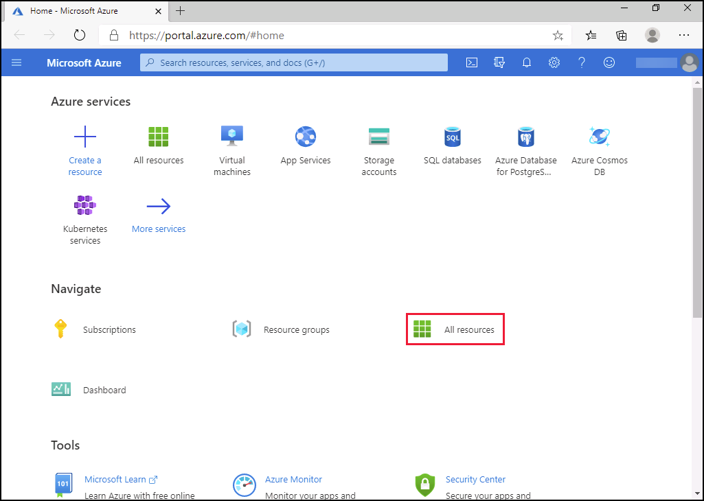

1. Search for **dp300 (1)** and select the Azure SQL Database server **dp300-lab-<inject key="Deployment-id" enableCopy="false" />(2)**

   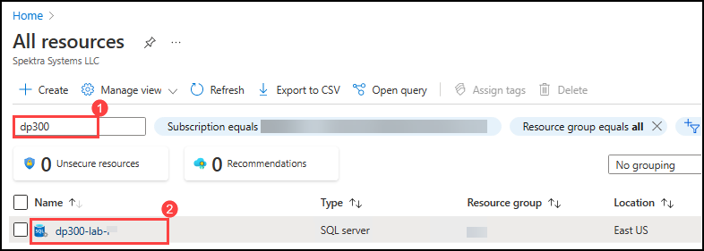

1. On the Overview page, select the **Not Configured** next to **Active Directory Admin**.

   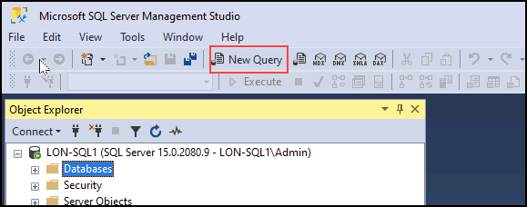

1. On the next screen, select **Set admin**.

   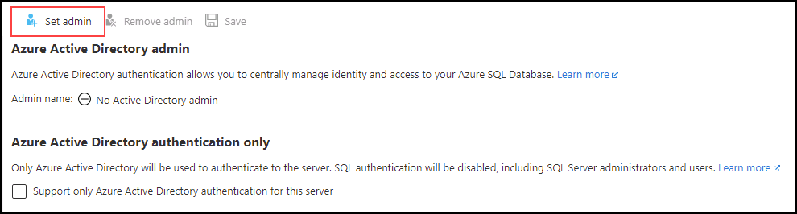

1. In the **Azure Active Directory** sidebar, search for the Azure username you logged into the Azure portal with, then click on **Select**.

1. Select **Save** to complete the process. This will make your username the Azure Active Directory admin for the server as shown below.

   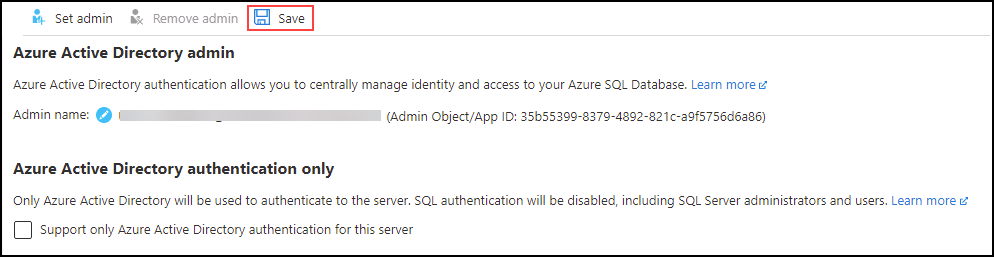

1. On the left navigation select **Overview (1)**, then copy the **Server name (2)** from right hand side.

   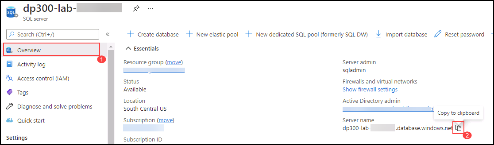

1. Select the Windows Start button and type **SSMS(1)**. Select **Microsoft SQL Server Management Studio 19(2)** from the list.  

   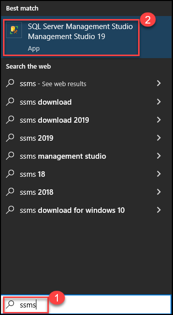

1. In the **Connect to Server** dialog box select **Database Engine** for Server type. In the **Server name** paste the name of your server you copied earlier. Change the authentication type to **Azure Active Directory Universal with MFA**.For the **User name** field, select the Azure **Username** from the **Environment Details (1)** tab and click on **Connect**

   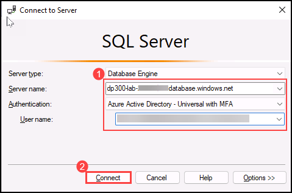

    >**NOTE:** When you first try to sign in to an Azure SQL database, You may be asked to add your client IP address to the firewall. SQL Server Management Studio can do this for you. Use the Azure Portal **password** from the **Environment Details** tab, then select **Sign in**, choose your Azure credentials and then select **OK**.
   
   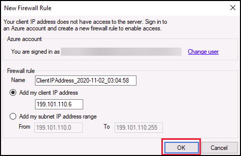
   
   > **Congratulations!** You have successfully completed this task. Please validate your progress by clicking on (...) icon from upper right corner of lab guide section and switch to Lab Validation tab and then click on Validate button for the respective task.

## Manage access to database objects

In this task you will manage access to the database and its objects. The first thing you will do is create two users in the *AdventureWorksLT* database.

1. Use the **Object Explorer** and expand **Databases**.

1. Right-click on **AdventureWorksLT**, and select **New Query**.

   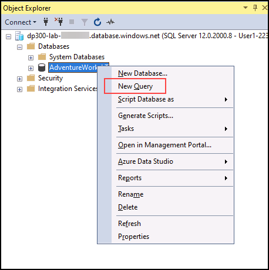

1. In the new query window, copy and paste the below T-SQL into it. **Execute** the query to create the two users.

    ```sql
    CREATE USER [DP300User1] WITH PASSWORD = 'Azur3Pa$$';
    GO

    CREATE USER [DP300User2] WITH PASSWORD = 'Azur3Pa$$';
    GO
    ```
    
    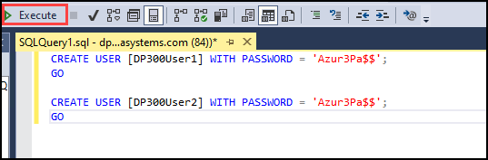
    
    **Note:** These users are created in the scope of the AdventureWorksLT database. Next you will create a custom role and add the users to it.

1. Execute the following T-SQL in the same query window.

    ```sql
    CREATE ROLE [SalesReader];
    GO

    ALTER ROLE [SalesReader] ADD MEMBER [DP300User1];
    GO

    ALTER ROLE [SalesReader] ADD MEMBER [DP300User2];
    GO
    ```

    Next create a new stored procedure in the **SalesLT** schema.

1. Execute the below T-SQL in your query window.

    ```sql
    CREATE OR ALTER PROCEDURE SalesLT.DemoProc
    AS
    SELECT P.Name, Sum(SOD.LineTotal) as TotalSales ,SOH.OrderDate
    FROM SalesLT.Product P
    INNER JOIN SalesLT.SalesOrderDetail SOD on SOD.ProductID = P.ProductID
    INNER JOIN SalesLT.SalesOrderHeader SOH on SOH.SalesOrderID = SOD.SalesOrderID
    GROUP BY P.Name, SOH.OrderDate
    ORDER BY TotalSales DESC
    GO
    ```

    Next use the `EXECUTE AS USER` syntax to test out the security. This allows the database engine to execute a query in the context of your user.

1. Execute the following T-SQL.

    ```sql
    EXECUTE AS USER = 'DP300User1'
    EXECUTE SalesLT.DemoProc
    ```

    This will fail with the message:

    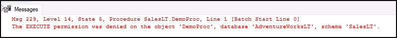

1. Next grant permissions to the role to allow it to execute the store procedure. Execute the below T-SQL.

    ```sql
    REVERT;
    GRANT EXECUTE ON SCHEMA::SalesLT TO [SalesReader];
    GO
    ```

    The first command reverts the execution context back to the database owner.

1. Rerun the previous T-SQL.

    ```sql
    EXECUTE AS USER = 'DP300User1'
    EXECUTE SalesLT.DemoProc
    ```

   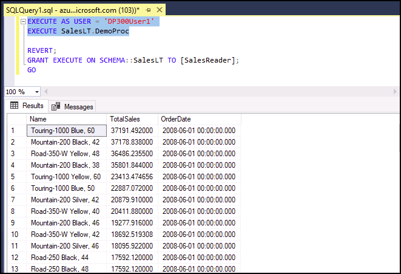

In this exercise, you've seen how you can use Azure Active Directory to grant Azure credentials  access to a SQL Server hosted in Azure. You've also used T-SQL statement to create new database users and granted them permissions to run stored procedures.
