---
lab:
    title: 'Lab 4 – Configure Azure SQL Database firewall rules'
    module: 'Implement a Secure Environment for a Database Service'
---

# Implement a Secure Environment

**Estimated Time: 30 minutes**

The students will take the information gained in the lessons to configure and subsequently implement security in the Azure Portal and within the AdventureWorks database.

You have been hired as a Senior Database Administrator to help ensure the security of the database environment. These tasks will focus on Azure SQL Database.

**Note:** These exercises ask you to copy and paste T-SQL code. Please verify that the code has been copied correctly, before executing the code.

## Configure Azure SQL Database firewall rules

1. From the lab virtual machine, start a browser session and navigate to [https://portal.azure.com](https://portal.azure.com/). Connect to the Portal using the Azure **Username** and **Password** provided on the **Resources** tab for this lab virtual machine.

    

1. From the Azure Portal, search for **SQL servers (1)** in the search box at the top, then click **SQL servers (2)** from the list of options.

    

1. Select the server name **dp300-lab-XXXXXXXX** to be taken to the detail page (you may have a different resource group and location assigned for your SQL server).

    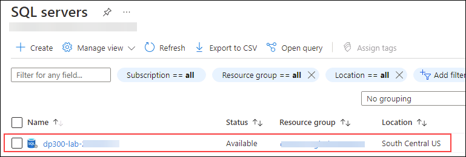

1. In the detail screen for your SQL server, move your mouse to the right of the server name, and then select **Copy to clipboard** button as shown below.

    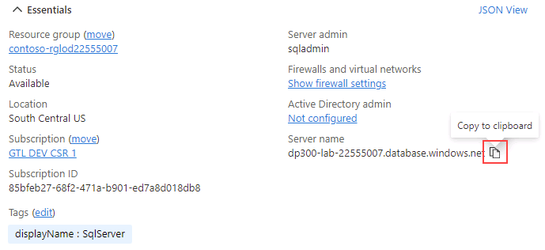

1. Select **Show networking settings**.

    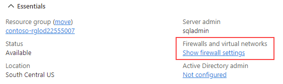

1. On the **Networking** page, click on **+ Add your client IPv4 address (your IP address)**, and then click **Save**.

    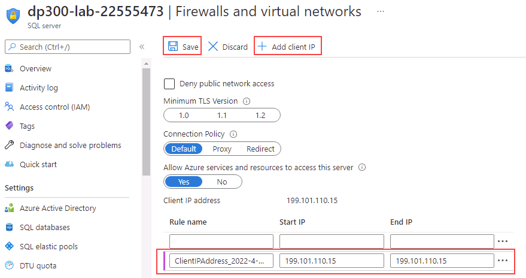

    **Note:** Your client IP address was automatically entered for you. Adding your client IP address to the list will allow you to connect to your Azure SQL Database using SQL Server Management Studio or any other client tools. **Make note of your client IP address, you will use it later.**

1. Open SQL Server Management Studio. On the Connect to Server dialog box, paste in the name of your Azure SQL Database server, and login with the credentials below:

    - **Server name:** &lt;_paste your Azure SQL Database server name here_&gt;
    - **Authentication:**SQL Server Authentication**
    - **Server admin login:**dp300admin**
    - **Password:**dp300P@ssword!**

    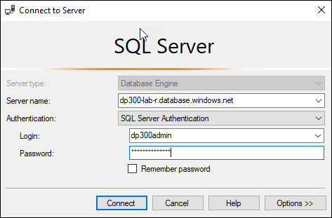

1. Click **Connect**.

1. In Object Explorer expand the server node, and right click on **Databases**. Click **Import a Data-tier Application**.

    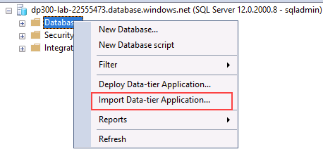

1. In the **Import Data Tier Application** dialog, click **Next** on the first screen.

1. Download the .bacpac file located on **https://github.com/MicrosoftLearning/dp-300-database-administrator/blob/master/Instructions/Templates/AdventureWorksLT.bacpac** to **C:\LabFiles\Secure Environment**  path on the lab VM (create the folder structure if it does not exist).

1. In the **Import Settings** screen, click **Browse** and navigate to **C:\LabFiles\Secure Environment** folder, click on the **AdventureWorksLT.bacpac** file, and then click **Open**. Back to the **Import Data-tier Application** screen click **Next**.

    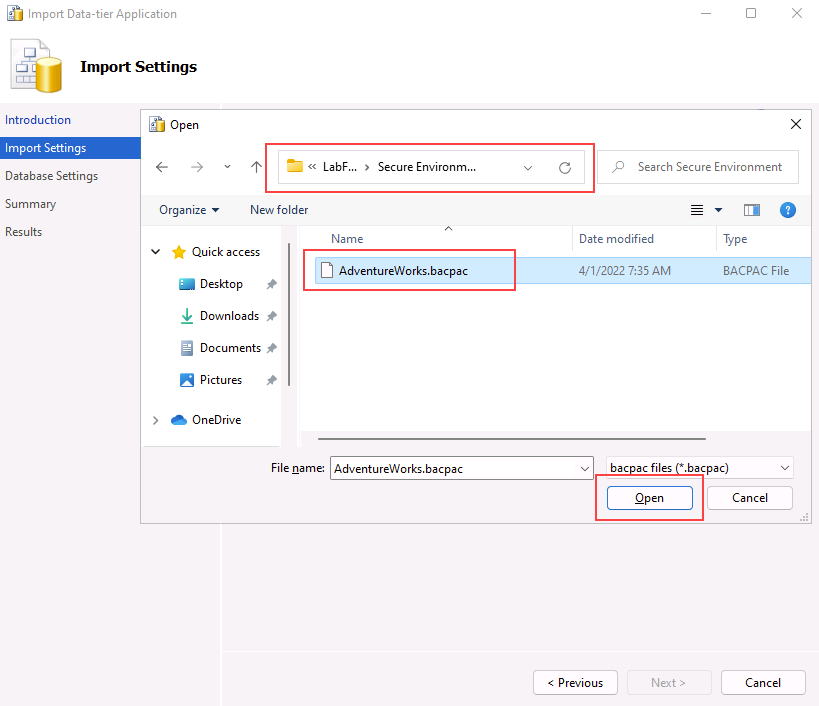

    

1. On the **Database Settings** screen, make the changes as below:

    - **Database name:** AdventureWorksFromBacpac
    - **Edition of Microsoft Azure SQL Database**: Basic

    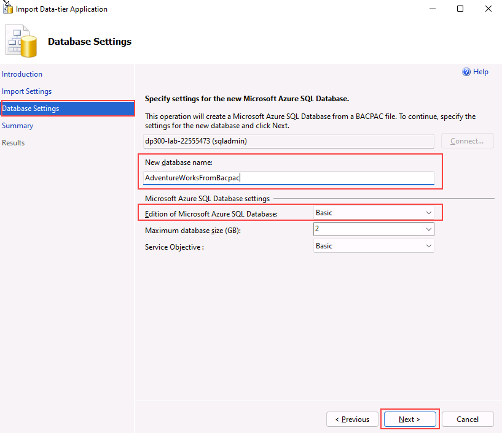

1. Click **Next**.

1. On the **Summary** screen click **Finish**. When your import completes you will see the results below. Then click **Close**.

    

1. Back to SQL Server Management Studio, in **Object Explorer**, expand the **Databases** folder. Then right-click on **AdventureWorksFromBacpac** database, and then **New Query**.

    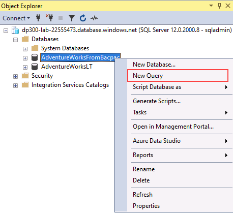

1. Execute the following T-SQL query by pasting the text into your query window.
    1. **Important:** Replace **000.000.000.00** with your client IP address. Click **Execute** or press **F5**.

    ```sql
    EXECUTE sp_set_database_firewall_rule 
            @name = N'AWFirewallRule',
            @start_ip_address = '000.000.000.00', 
            @end_ip_address = '000.000.000.00'
    ```

1. Next you will create a contained user in the **AdventureWorksFromBacpac** database. Click **New Query** and execute the following T-SQL.

    ```sql
    USE [AdventureWorksFromBacpac]
    GO
    CREATE USER ContainedDemo WITH PASSWORD = 'P@ssw0rd01'
    ```

    

    **Note:** This command creates a contained user within the **AdventureWorksFromBacpac** database. We will test this credential in the next step.

1. Navigate to the **Object Explorer**. Click on **Connect**, and then **Database Engine**.

    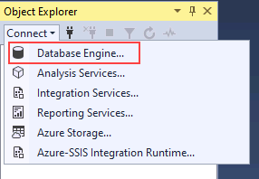

1. Attempt to connect with the credentials you created in the previous step. You will need to use the following information:

    - **Login:** ContainedDemo
    - **Password:** P@ssw0rd01

     Click **Connect**.

     You will receive the following error.

    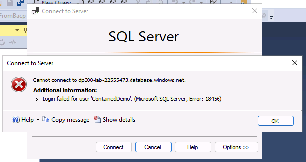

    **Note:** This error is generated because the connection attempted to login to the *master* database and not **AdventureWorksFromBacpac** where the user was created. Change the connection context by clicking **OK** to exit the error message, and then clicking on **Options >>** in the **Connect to Server** dialog box as shown below.

    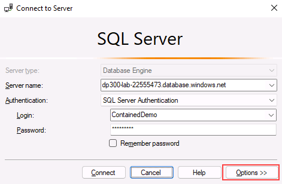

1. On the **Connection Properties** tab, type the database name **AdventureWorksFromBacpac**, and then click **Connect**.

    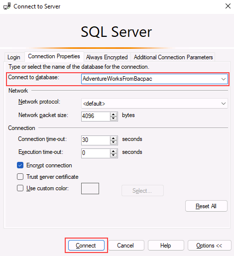

1. Notice that you were able to successfully authenticate using the **ContainedDemo** user. This time you were directly logged into **AdventureWorksFromBacpac**, which is the only database to which the newly created user has access to.

    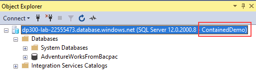

In this exercise, you've configured server and database firewall rules to access a database hosted on Azure SQL Database. You've also used T-SQL statements to create a contained user, and used SQL Server Management Studio to check the access.
