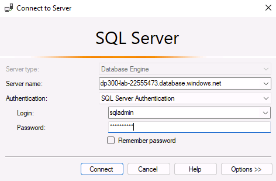

---
lab:
    title: 'Lab 4 – Implement a Secure Environment'
    module: 'Implement a Secure Environment for a Database Service'
---

# Implement a Secure Environment

**Estimated Time: 60 minutes**

The students will take the information gained in the lessons to configure and subsequently implement security in the Azure Portal and within the AdventureWorks database.

You have been hired as a Senior Database Administrator to help ensure the security of the database environment. These tasks will focus on Azure SQL Database.

**Note:** These exercises ask you to copy and paste T-SQL code. Please verify that the code has been copied correctly, before executing the code.

## Configure an Azure SQL Database firewall

1. From the lab virtual machine, start a browser session and navigate to [https://portal.azure.com](https://portal.azure.com/). Connect to the Portal using the Azure **Username** and **Password** provided on the **Resources** tab for this lab virtual machine.

    

1. From the Azure Portal, search for “SQL servers” in the search box at the top, then click **SQL servers** from the list of options.

    

1. Select the server name **dp300-lab-XXXXXXXX** to be taken to the detail page (you may have a different resource group and location assigned for your SQL server).

    

1. In the detail screen for your SQL server, move your mouse to the right of the server name, and then select **Copy to clipboard** button as shown below.

    

1. Click on **Show firewall settings**.

    

1. On the **Firewalls and virtual networks** page, click on **+ Add client IP**, and then click **Save**.

    

    **Note:** Notice that your client IP address was automatically entered for you. Adding your client IP address to the list will allow you to connect to your Azure SQL Database using SQL Server Management Studio or any other client tools. **Make note of your client IP address, you will use it later.**

1. Open SQL Server Management Studio. On the Connect to Server dialog box, paste in the name of your Azure SQL Database server, and login with the credentials below:

    - **Server name:** &lt;_paste your Azure SQL Database server name here_&gt;
    - **Authentication:** SQL Server Authentication
    - **Server admin login:** sqladmin
    - **Password:** P@ssw0rd01

	

1. Click **Connect**.

1. In Object Explorer expand the server node, and right click on **Databases**. Click **Import a Data-tier Application**.

	

1. In the **Import Data Tier Application** dialog, click **Next** on the first screen.

1. In the Import Settings screen, click Browse and navigate to D:\Labfiles\Secure Environment folder and click on the AdventureWorks.bacpac file and click open. Then in the Import Data-tier application screen click **Next**.

	

	

9. On the database settings screen, change the edition of Azure SQL Database to General Purpose. Change the Service Objective to **GP_Gen5_2** and click **Next**. 

	

10.  On the Summary screen click **Finish**. When your import completes you will see the results below. Then click **Close**
	

11. In Object Explorer, expand the Databases folder. Then right-click on AdventureWorks and click on new query. 

	

12. Execute the following T-SQL query by pasting the text into your query window. **Important:** Replace 192.168.1.1. with your client IP address from Step 4. Click execute or press F5.

	```sql
	EXECUTE sp_set_database_firewall_rule @name = N'ContosoFirewallRule',

	@start_ip_address = '192.168.1.1', @end_ip_address = '192.168.1.1'
	```

13. Next you will create a contained user in the AdventureWorks database. Click New Query and execute the following T-SQL. Ensure that you are still using the AdventureWorks database. If you see master in the database name box below, you can pull down and switch to AdventureWorks.

	```sql
	CREATE USER containeddemo WITH PASSWORD = 'P@ssw0rd!'
	```
    
    
    Click **Execute** to run this command. This command creates a contained user within the AdventureWorks database. You will login using the username and password in the next step.
    
14. Navigate to the Object Explorer. Click on **Connect** and then **Database Engine**.

	

15. Attempt to connect with the credentials you created in step 13. 
    You will need to use the following information:  
	-  **Login:** containeddemo   
	-  **Password:**  P@ssw0rd! 
	 
     Click **Connect**.
	 
     You will see the following error.

	

	This error is generated because the connection attempted to login to the master database and not AdventureWorks where the user was created. Change the connection context by clicking **OK** to exit the error message and then clicking on **Options >>** in the Connect to Server dialog box as shown below.

	

16. On the connection options tab, type the database name AdventureWorks. Click **Connect**.

	

17. Another database should appear in the Object Explorer. 

    

    Make sure the selection stays on the newly added database. Then click **Connect** from the Object Explorer and **Database Engine**. 
    Enter the following again: 
    - **Login:** containeddemo   
	- **Password:**  P@ssw0rd! 

    Click **Connect**.

    This time the connection bypasses the master database and logs you directly into AdventureWorks, which is the only database to which the newly created user has access.

