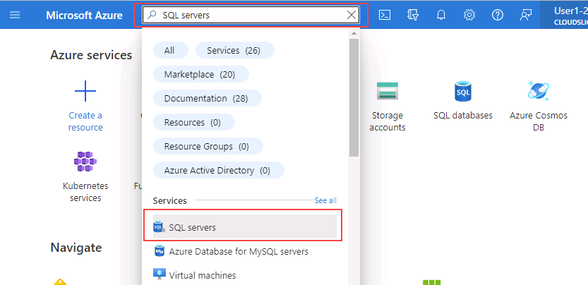
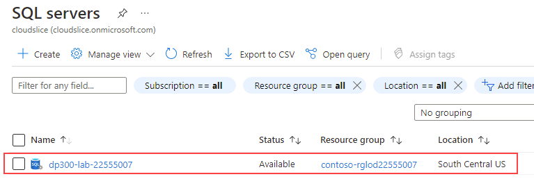
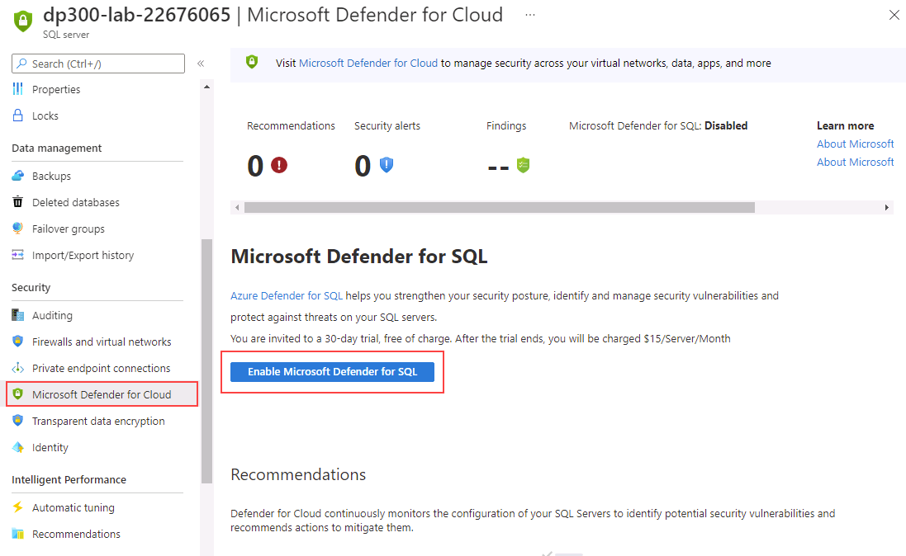
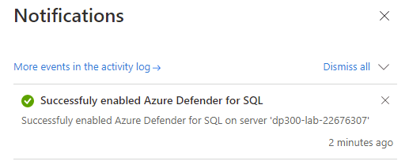
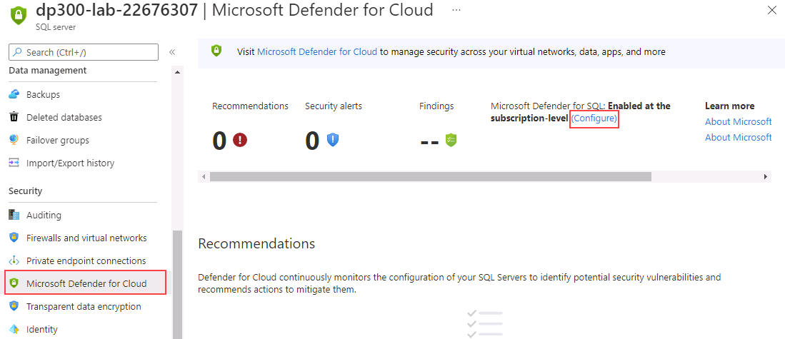
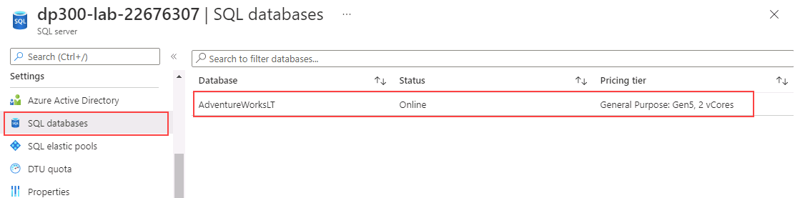
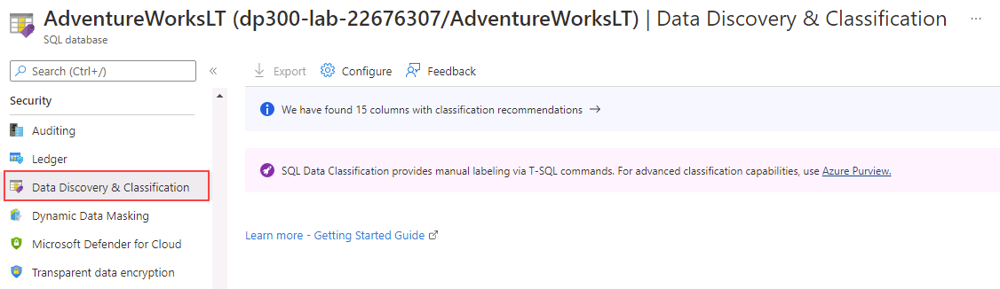
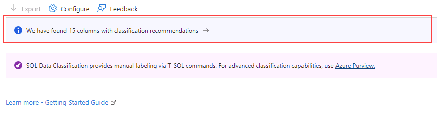
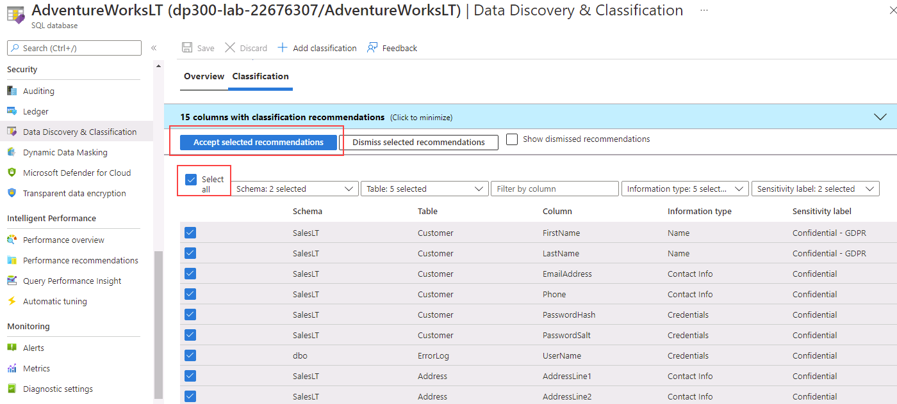
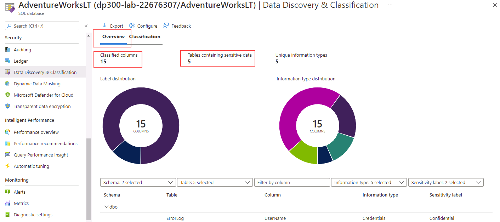

---
lab:
    title: 'Lab 5 – Enable Microsoft Defender for SQL and Data classification'
    module: 'Implement a Secure Environment for a Database Service'
---

# Enable Microsoft Defender for SQL and Data Classification

**Estimated Time: 20 minutes**

The students will take the information gained in the lessons to configure and subsequently implement security in the Azure Portal and within the AdventureWorks database.

You have been hired as a Senior Database Administrator help ensure the security of the database environment. These tasks will focus on Azure SQL Database.

## Enable Microsoft Defender for SQL

1. From the lab virtual machine, start a browser session and navigate to [https://portal.azure.com](https://portal.azure.com/). Connect to the Portal using the Azure **Username** and **Password** provided on the **Resources** tab for this lab virtual machine.

    

1. From the Azure Portal, search for “SQL servers” in the search box at the top, then click **SQL servers** from the list of options.

    

1. Select the server name **dp300-lab-XXXXXXXX** to be taken to the detail page (you may have a different resource group and location assigned for your SQL server).

    

1. From the main blade of your Azure SQL server, navigate to the **Security** section, and select **Microsoft Defender for Cloud**.

    

    On the **Microsoft Defender for Cloud** page, select **Enable Microsoft Defender for SQL**.

1. The following notification message will show up after Azure Defender for SQL is successfully enabled.

    

1. On the **Microsoft Defender for Cloud** page, select the **Configure** link (You may need to refresh the page to see this option)

    

1. On the **Server settings** page, notice that toggle switch under **MICROSOFT DEFENDER FOR SQL** is set to **ON**.

## Enable Data Classification

1. From the main blade of your Azure SQL server, navigate to the **Settings** section, and select **SQL databases**, and then select the database name.

    

1. On the main blade for the **AdventureWorksLT** database, navigate to the **Security** section, and then select **Data Discovery & Classification**.

    

1. On the **Data Discovery & Classification** page, you will see an informational message that reads: **Currently using SQL Information Protection policy. We have found 15 columns with classification recommendations**. Select this link.

    

1. On the next **Data Discovery & Classification** screen select the check box next to **Select all**, select **Accepted selected recommendations**, and then select **Save** to save the classifications into the database.

    

1. Back to the **Data Discovery & Classification** screen, notice that fifteen columns were successfully classified across five different tables.

    

In this exercise, you've enhanced the security of an Azure SQL Database by enabling Microsoft Defender for SQL. You've also created classified columns based on Azure portal recommendations.
