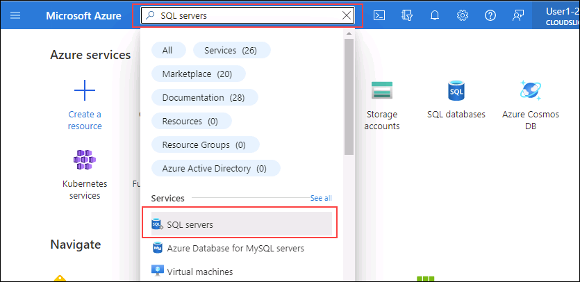
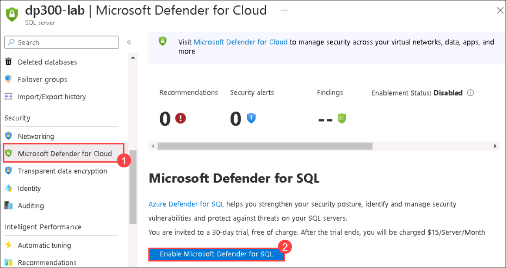
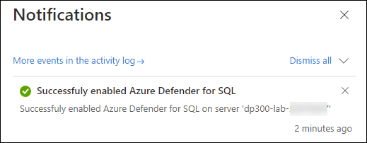
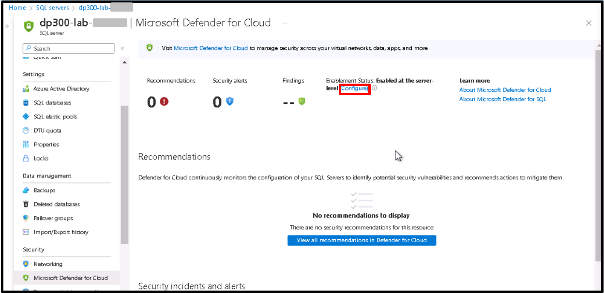
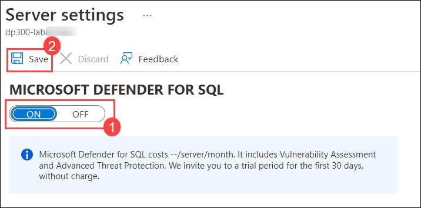
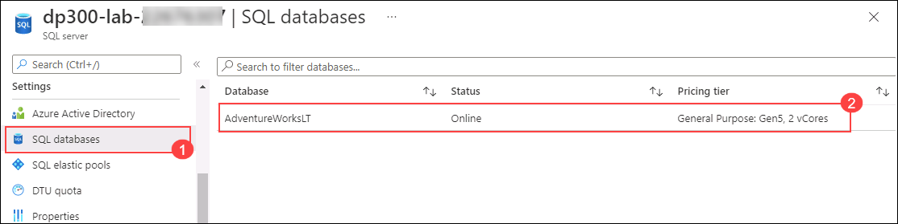
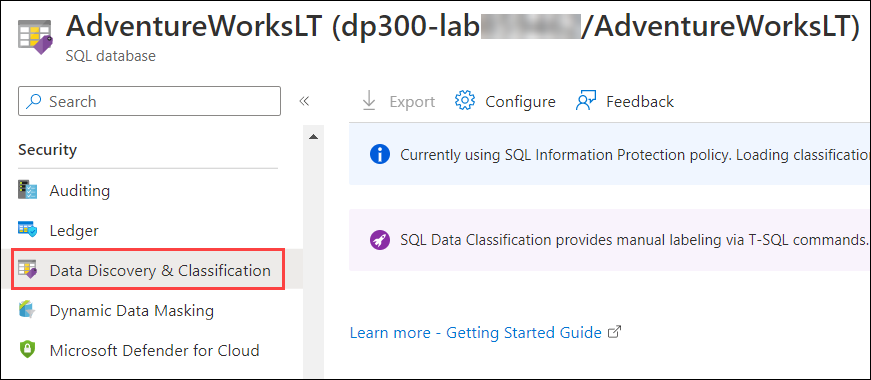
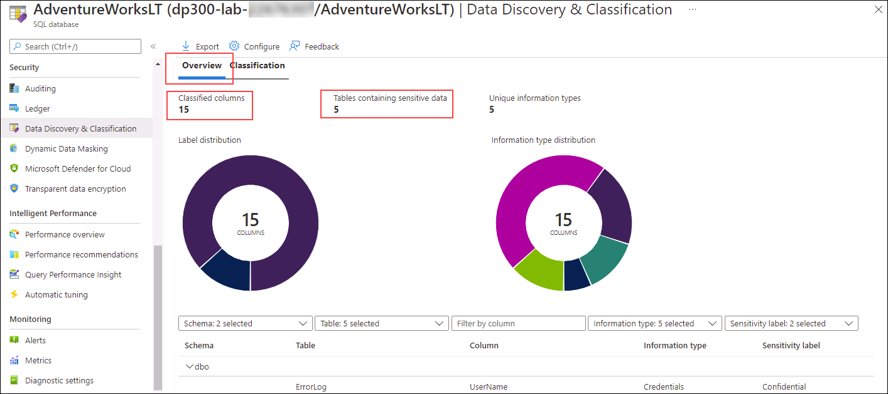

# Enable Microsoft Defender for SQL and Data Classification

The students will take the information gained in the lessons to configure and subsequently implement security in the Azure Portal and within the AdventureWorks database.

You have been hired as a Senior Database Administrator help ensure the security of the database environment. These tasks will focus on Azure SQL Database.

## Enable Microsoft Defender for SQL

1. From the Azure Portal, search for “SQL servers” in the search box at the top, then click on **SQL servers** from the list of options.

    

1. Select the server name **dp300-lab- <inject key="Deployment-id"></inject>** to be taken to the detail page (you may have a different location assigned for your SQL server).

    

1. From the main blade of your Azure SQL server, navigate to the **Security** section, and select **Microsoft Defender for Cloud (1)**.

    

    On the **Microsoft Defender for Cloud** page, select **Enable Microsoft Defender for SQL (2)**.

1. The following notification message will show up after Azure Defender for SQL is successfully enabled.

    

1. On the **Microsoft Defender for Cloud** page, select the **Configure** link (You may need to refresh the page to see this option)

    

1. On the **Server settings** page, notice that toggle switch under **MICROSOFT DEFENDER FOR SQL** is set to **ON (1)**, and then select **Save (2)**.

    

## Enable Data Classification

> **Note:** 
> - Microsoft Defender for Cloud can take upto 24-48 hours to surface post the completion of a scan.
> - At this point of the workshop, no data visualisations may be populated. (So the result in the screenshot below may vary)

1. From the main blade of your Azure SQL server, navigate to the **Settings** section, and select **SQL databases (1)**, and then select the database name **(2)**.

    

1. On the main blade for the **AdventureWorksLT** database, navigate to the **Security** section, and then select **Data Discovery & Classification**.

    

1. On the **Data Discovery & Classification** screen, you can find the recommended classifications.

   > **Note:** The screenshot and information below, has been provided so that you can conceptualise the type of graphs and output that can be gleaned from a fully populated environment.

    

In this exercise, you've enhanced the security of an Azure SQL Database by enabling Microsoft Defender for SQL. You've also created classified columns based on Azure portal recommendations.
