# Isolate performance problems through monitoring

The students will take the information gained in the lessons to scope out the deliverables for a digital transformation project within AdventureWorks. Examining the Azure portal as well as other tools, students will determine how to utilize tools to identify and resolve performance related issues.

You have been hired as a database administrator to identify performance related issues and provide viable solutions to resolve any issues found. You need to use the Azure portal to identify the performance issues and suggest methods to resolve them.

>**Note:** These exercises ask you to copy and paste T-SQL code. Please verify that the code has been copied correctly, before executing the code.

## Review CPU utilization in Azure portal
  
1. From the Azure Portal, search for “SQL servers” in the search box at the top, then click **SQL servers** from the list of options.

    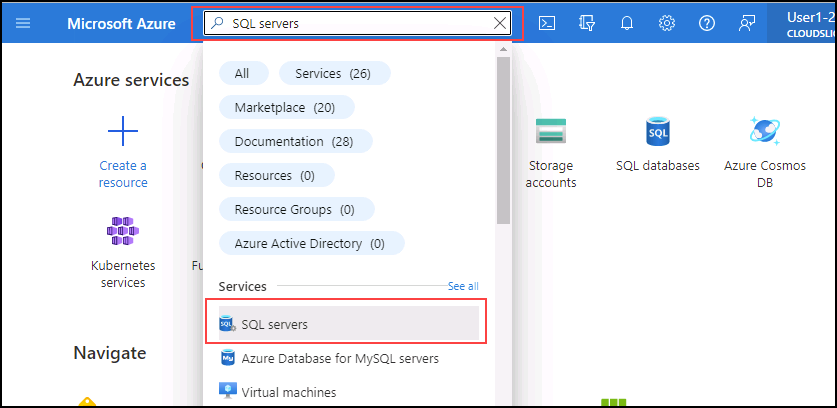

1. Select the server name **dp300-lab-<inject key="Deployment-id" enableCopy="false" />**

    

1. From the main blade of your Azure SQL server, navigate to the **Settings** section, and select **SQL databases**, and then select the database name.

    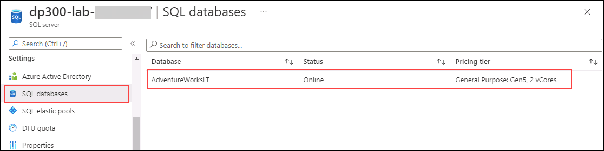

1. On the database **Overview** page, select **Set server firewall**.

    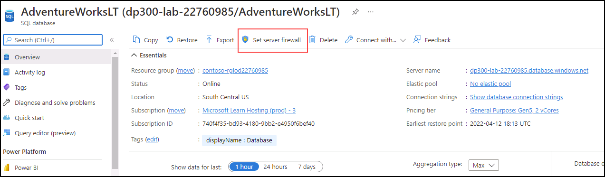

1. On the **Networking** page, select **+ Add your client IPv4 address (your IP address)**, then select **Save**.

    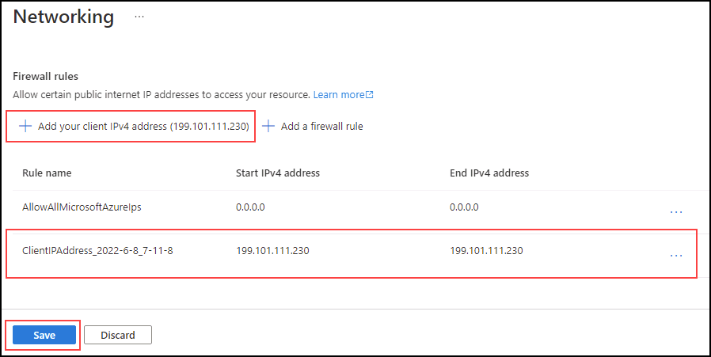

1. In the navigation above **Networking**, select the link that begins with **AdventureWorksLT**.

    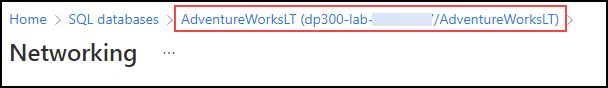

1. In the left navigation, select **Query editor (preview)**.

    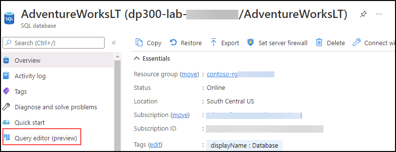


1. In **Password**, type **P@ssw0rd01** and select **OK**.

     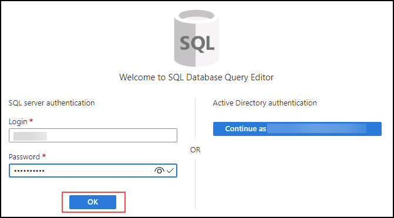

1. In **Query 1**, type the following query, and select **Run**:

    ```sql
    DECLARE @Counter INT 
    SET @Counter=1
    WHILE ( @Counter <= 10000)
    BEGIN
        SELECT 
             RTRIM(a.Firstname) + ' ' + RTRIM(a.LastName)
            , b.AddressLine1
            , b.AddressLine2
            , RTRIM(b.City) + ', ' + RTRIM(b.StateProvince) + '  ' + RTRIM(b.PostalCode)
            , CountryRegion
            FROM SalesLT.Customer a
            INNER JOIN SalesLT.CustomerAddress c 
                ON a.CustomerID = c.CustomerID
            RIGHT OUTER JOIN SalesLT.Address b
                ON b.AddressID = c.AddressID
        ORDER BY a.LastName ASC
        SET @Counter  = @Counter  + 1
    END
    ```

    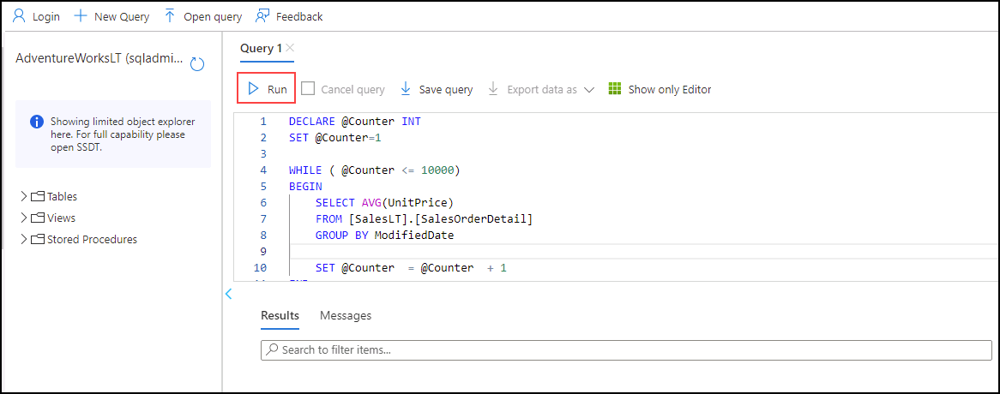

1. Wait for the query to complete.

1. On the blade for the **AdventureWorksLT** database, select the **Metrics** icon on the **Monitoring** section.

    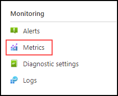

1. Change the **Metric** menu option to reflect **CPU Percentage**, then select an **Aggregation** of **Avg**. This will display the average CPU Percentage for the given time frame.

    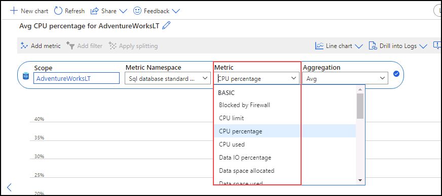

1. Observe the the CPU average across time. You may slightly different results. Alternatively, you can run the query multiple times to obtain a more substantial results.

    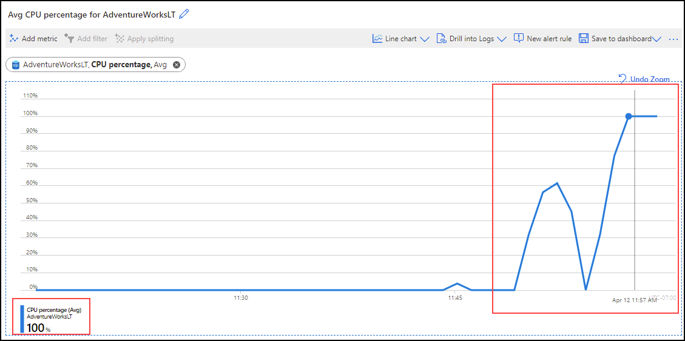

## Identify high CPU queries

1. Locate the **Query Performance Insight** icon on the **Intelligent Performance** section of the blade for the **AdventureWorksLT** database.

    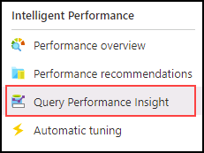

1. Select **Reset settings**.

    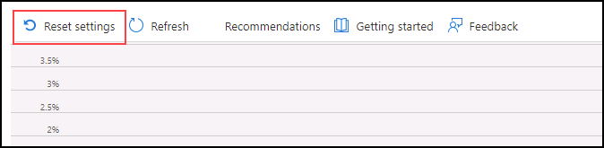

1. Click on the query in the grid below the graph. If you do not see a query, wait for 2 minutes and select **Refresh**.

   > **Note:** You may have different duration and query ID. If you see more than one query, click on each one to observe the results.

    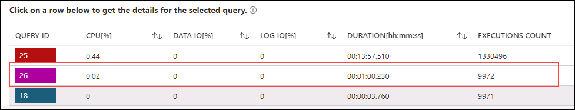

    For this query, you can see that the total duration was over a minute and that it ran approximately 10,000 times.
    
    > **Congratulations**  on completing the task! Now, it's time to validate it. Here are the steps:
    1. Click the (...) icon located at the upper right corner of the lab guide section and navigate to the Lab Validation Page.
    2. Hit the Validate button for the corresponding task.
    3. If you receive a success message, you can proceed to the next task. If not, carefully read the error message and retry the step, following the instructions in          the lab guide.
    4. If you need any assistance, please contact us at labs-support@spektrasystems.com. We are available 24/7 to help you out. 

In this exercise, you've learned how to explore server resources for an Azure SQL Database and identify potential query performance issues through Query Performance Insight.
