# Identify and resolve blocking issues

The students will take the information gained in the lessons to scope out the deliverables for a digital transformation project within AdventureWorks. Examining the Azure portal as well as other tools, students will determine how to utilize native tools to identify and resolve performance related issues. Finally, students will be able to identify and resolve blocking issues appropriately.

You have been hired as a database administrator to identify performance related issues and provide viable solutions to resolve any issues found. You need to investigate the performance problems and suggest methods to resolve them.

>**Note:** These exercises ask you to copy and paste T-SQL code. Please verify that the code has been copied correctly, before executing the code.

## Restore a database

1. Select the Windows Start button and type SSMS. Select **Microsoft SQL Server Management Studio 19** from the list.  

    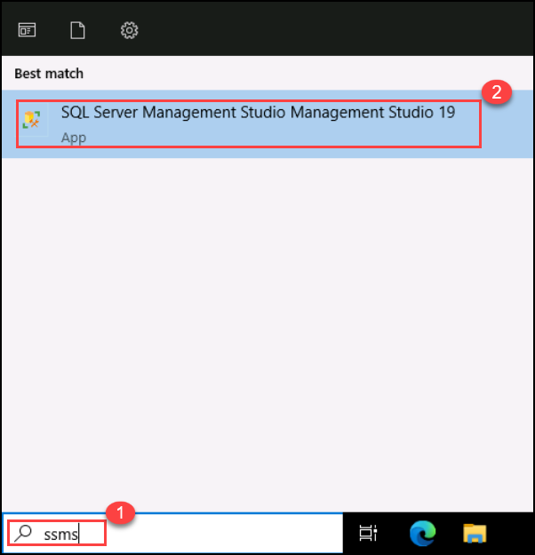

1. When SSMS opens, notice that the **Connect to Server** dialog will be pre-populated with the default instance name with **sqlvm-<inject key="DeploymentID" enableCopy="false" /> (1)**. Select **Connect (2)**.

    

3. Select the **Databases** folder, and then **New Query**.

    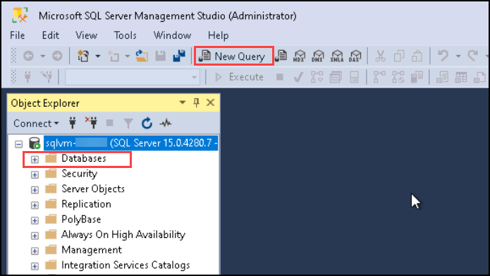

4. In the new query window, copy and paste the below T-SQL into it. Execute the query to restore the database.

    ```sql
    RESTORE DATABASE AdventureWorks2017
    FROM DISK = 'C:\LabFiles\Monitorandoptimize\AdventureWorks2017.bak'
    WITH RECOVERY,
          MOVE 'AdventureWorks2017' 
            TO 'C:\LabFiles\Monitorandoptimize\AdventureWorks2017.mdf',
          MOVE 'AdventureWorks2017_log'
            TO 'C:\LabFiles\Monitorandoptimize\AdventureWorks2017_log.ldf';
    ```

5. You should see a successful message after the restore is complete.

    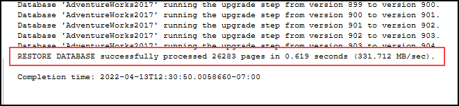

## Run blocked queries report

1. Select **New Query**. Copy and paste the following T-SQL code into the query window. Select **Execute** to execute this query.

    ```sql
    USE MASTER

    GO

    CREATE EVENT SESSION [Blocking] ON SERVER 
    ADD EVENT sqlserver.blocked_process_report(
    ACTION(sqlserver.client_app_name,sqlserver.client_hostname,sqlserver.database_id,sqlserver.database_name,sqlserver.nt_username,sqlserver.session_id,sqlserver.sql_text,sqlserver.username))
    ADD TARGET package0.ring_buffer
    WITH (MAX_MEMORY=4096 KB, EVENT_RETENTION_MODE=ALLOW_SINGLE_EVENT_LOSS, MAX_DISPATCH_LATENCY=30 SECONDS, MAX_EVENT_SIZE=0 KB,MEMORY_PARTITION_MODE=NONE, TRACK_CAUSALITY=OFF,STARTUP_STATE=ON)
    GO

    -- Start the event session 
    ALTER EVENT SESSION [Blocking] ON SERVER 
    STATE = start; 
    GO
    ```

    The above T-SQL code will create an Extended Event session that will capture blocking events. The data will contain the following elements:

    - Client application name
    - Client host name
    - Database ID
    - Database name
    - NT Username
    - Session ID
    - T-SQL Text
    - Username

1. Select **New Query**. Copy and paste the following T-SQL code into the query window. Select **Execute** to execute this query.

    ```sql
    EXEC sys.sp_configure N'show advanced options', 1
    RECONFIGURE WITH OVERRIDE;
    GO
    EXEC sp_configure 'blocked process threshold (s)', 60
    RECONFIGURE WITH OVERRIDE;
    GO
    ```

    >**Note:** The command above specify the threshold, in seconds, at which blocked process reports are generated. As a result, we are not required to wait as long for the *blocked_process_report* to be raised in this lesson.

1. Select **New Query**. Copy and paste the following T-SQL code into the query window. Select **Execute** to execute this query.

    ```sql
    USE AdventureWorks2017
    GO

    BEGIN TRANSACTION
        UPDATE Person.Person 
        SET LastName = LastName;

    GO
    ```

1. Open another query window by selecting the **New Query** button. Copy and paste the following T-SQL code into the new query window. Select **Execute** to execute this query.

    ```sql
    USE AdventureWorks2017
    GO

    SELECT TOP (1000) [LastName]
      ,[FirstName]
      ,[Title]
    FROM Person.Person
    WHERE FirstName = 'David'
    ```

    >**Note:** this query does not return any results and appears to run indefinitely.

1. In **Object Explorer**, expand  **Management** -> **Extended Events** -> **Sessions** -> **Blocking**.

    Notice the extended event named *Blocking* we just created is in the list.

    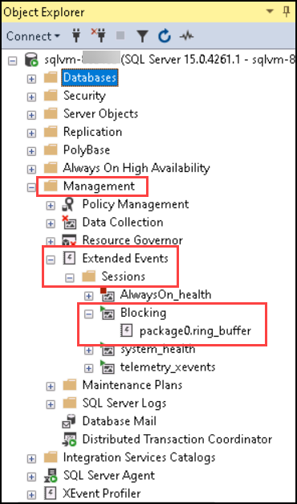

1. Right click on **package0.ring_buffer**, and then select **View Target Data**.

    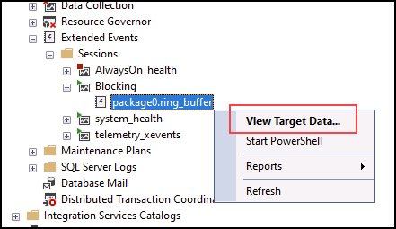

1. Select the hyperlink.

    

1. The XML will show you which processes are being blocked, and which process is causing the blocking. You can see the queries that ran in this process as well as system information.

    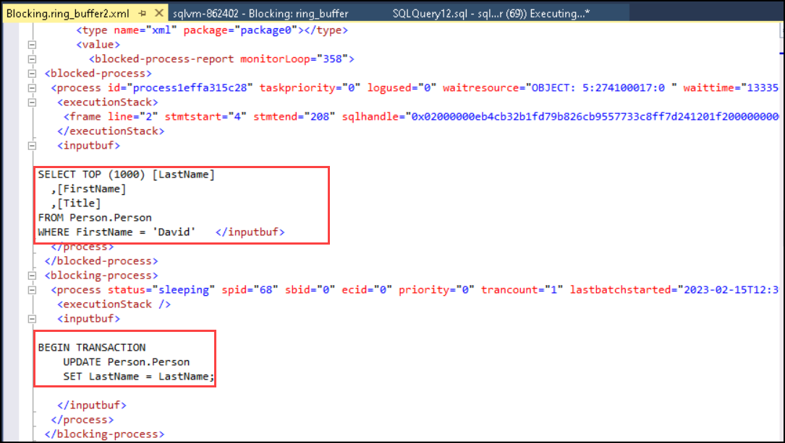
    
    >**Note:** This above XML File might take sometime to open please proceed with next step.

1. Alternatively, you can run the query below to identify sessions blocking other sessions, including a list of session IDs blocked per *session_id*.

    ```sql
    WITH cteBL (session_id, blocking_these) AS 
    (SELECT s.session_id, blocking_these = x.blocking_these FROM sys.dm_exec_sessions s 
    CROSS APPLY    (SELECT isnull(convert(varchar(6), er.session_id),'') + ', '  
                    FROM sys.dm_exec_requests as er
                    WHERE er.blocking_session_id = isnull(s.session_id ,0)
                    AND er.blocking_session_id <> 0
                    FOR XML PATH('') ) AS x (blocking_these)
    )
    SELECT s.session_id, blocked_by = r.blocking_session_id, bl.blocking_these
    , batch_text = t.text, input_buffer = ib.event_info, * 
    FROM sys.dm_exec_sessions s 
    LEFT OUTER JOIN sys.dm_exec_requests r on r.session_id = s.session_id
    INNER JOIN cteBL as bl on s.session_id = bl.session_id
    OUTER APPLY sys.dm_exec_sql_text (r.sql_handle) t
    OUTER APPLY sys.dm_exec_input_buffer(s.session_id, NULL) AS ib
    WHERE blocking_these is not null or r.blocking_session_id > 0
    ORDER BY len(bl.blocking_these) desc, r.blocking_session_id desc, r.session_id;
    ```

    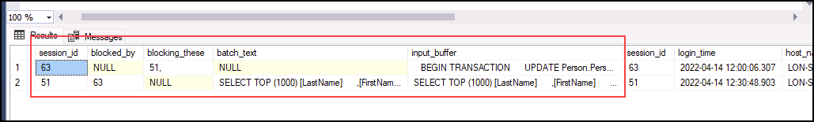

1. Right click on extended event named **Blocking**, and then select **Stop Session**.

    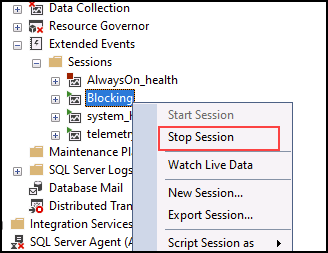

1. Navigate back to the query session that is causing the blocking, and type `ROLLBACK TRANSACTION` on the line below the query. Highlight `ROLLBACK TRANSACTION`, and select **Execute**.

    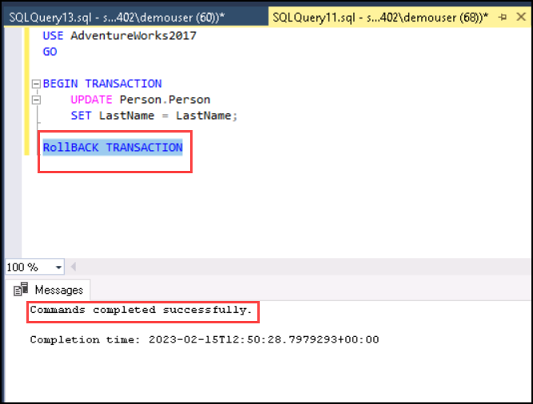

1. Navigate back to the query session that was being blocked. You will notice that the query has now completed.

    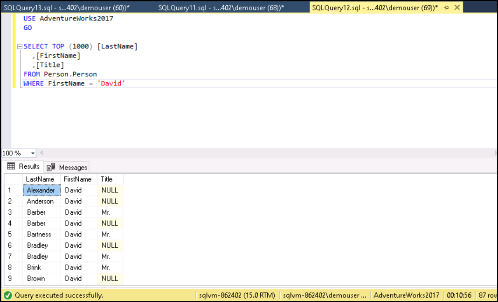

## Enable Read Commit Snapshot isolation level

1. Select **New Query** from SQL Server Management Studio. Copy and paste the following T-SQL code into the query window. Select the **Execute** button to execute this query.

    ```sql
    USE master
    GO
    
    ALTER DATABASE AdventureWorks2017 SET READ_COMMITTED_SNAPSHOT ON WITH ROLLBACK IMMEDIATE;
    GO
    ```

1. Rerun the query that caused the blocking in a new query editor.

    ```sql
    USE AdventureWorks2017
    GO
    
    BEGIN TRANSACTION
        UPDATE Person.Person 
        SET LastName = LastName;
    GO
    ```

1. Rerun the query that was being blocked in a new query editor.

    ```sql
    USE AdventureWorks2017
    GO
    
    SELECT TOP (1000) [LastName]
     ,[FirstName]
     ,[Title]
    FROM Person.Person
    WHERE firstname = 'David'
    ```

    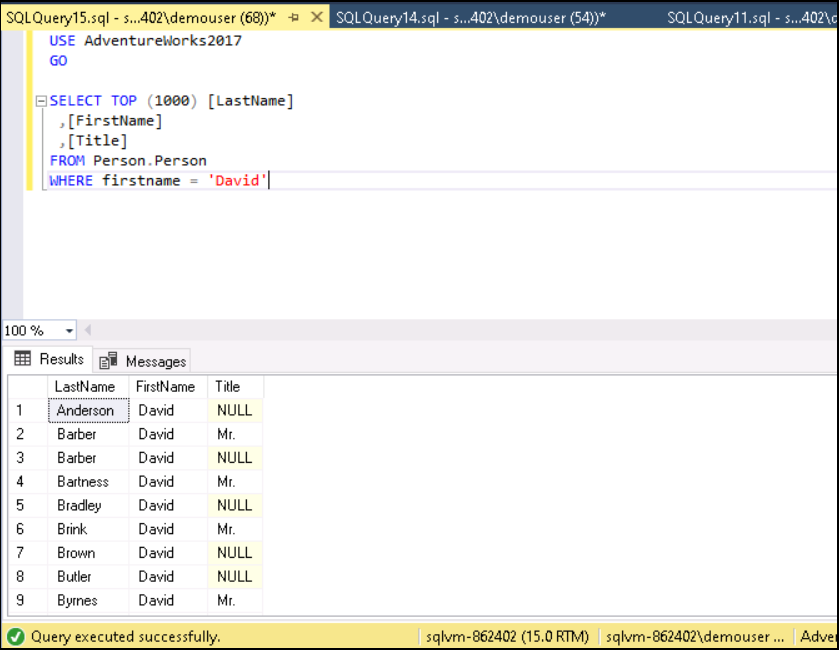

    Why the same query completes whereas in the previous task it was blocked by the update statement?

    Read Commit Snapshot isolation level is an optimistic form of transaction isolation, and the last query will show the latest committed version of the data, rather than being blocked.

In this exercise, you've learned how to identify sessions being blocked, and to mitigate those scenarios.
