# Isolate problem areas in poorly performing queries in a SQL Database

You've been hired as a Senior Database Administrator to help with performance issues currently happening when users query the *AdventureWorks2017* database. Your job is to identify issues in query performance and remedy them using techniques learned in this module.

You'll run queries with suboptimal performance, examine the query plans, and attempt to make improvements within the database.

>**Note:** These exercises ask you to copy and paste T-SQL code. Please verify that the code has been copied correctly, before executing the code.

## Restore a database

1. Select the Windows Start button and type **SSMS (1)**. Select **Microsoft SQL Server Management Studio 18 (2)** from the list.  

    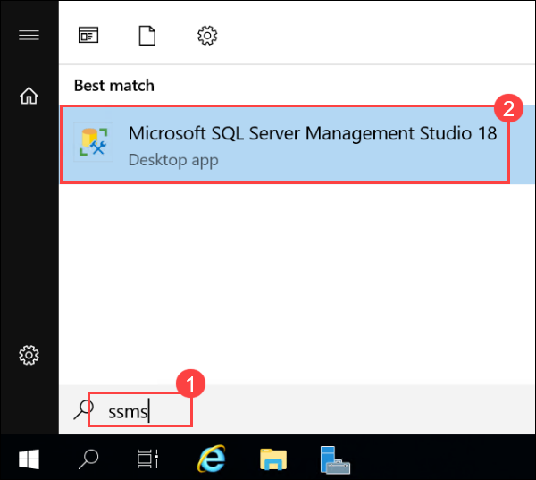

1. When SSMS opens, notice that the **Connect to Server** dialog will be pre-populated with the default instance name with **sqlvm-<inject key="DeploymentID" enableCopy="false" /> (1)**. Select **Connect (2)**.

    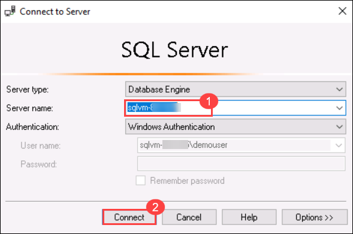
    
1. Select the **Databases (1)** folder, and then **New Query (2)**.

    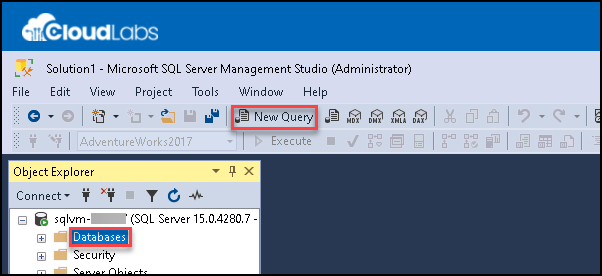

1. In the **New query** window, copy and paste the below T-SQL into it. Execute the query to restore the database.

    ```sql
    RESTORE DATABASE AdventureWorks2017
    FROM DISK = 'C:\LabFiles\Monitorandoptimize\AdventureWorks2017.bak'
    WITH RECOVERY,
          MOVE 'AdventureWorks2017' 
            TO 'C:\LabFiles\Monitorandoptimize\AdventureWorks2017.mdf',
          MOVE 'AdventureWorks2017_log'
            TO 'C:\LabFiles\Monitorandoptimize\AdventureWorks2017_log.ldf';
    ```

1. You should see a successful message after the restore is complete.

    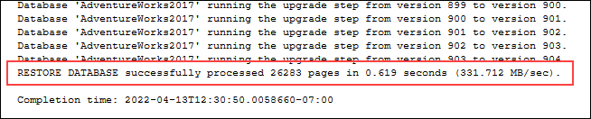

## Generate actual execution plan

There are several ways to generate an execution plan in SQL Server Management Studio.

1. Select **New Query**. Copy and paste the following T-SQL code into the query window. Select **Execute** to execute this query.

    > **Note:** Use **SHOWPLAN_ALL** to see a text version of a query's execution plan in the results pane instead of graphically in a separate tab.

    ```sql
    USE AdventureWorks2017;
    GO

    SET SHOWPLAN_ALL ON;
    GO

    SELECT BusinessEntityID
    FROM HumanResources.Employee
    WHERE NationalIDNumber = '14417807';
    GO

    SET SHOWPLAN_ALL OFF;
    GO
    ```

    You'll see a text version of the execution plan, instead of the actual query results for the **SELECT** statement.

      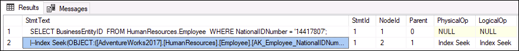

1. Take a moment to examine the text in the second row of the **StmtText** column:

    ```console
    |--Index Seek(OBJECT:([AdventureWorks2017].[HumanResources].[Employee].[AK_Employee_NationalIDNumber]), SEEK:([AdventureWorks2017].[HumanResources].[Employee].[NationalIDNumber]=CONVERT_IMPLICIT(nvarchar(4000),[@1],0)) ORDERED FORWARD)
    ```

    The above text explains that the execution plan use an **Index Seek** on the **AK_Employee_NationalIDNumber** key. It also shows that the execution plan needed to do a **CONVERT_IMPLICIT** step.

    The query optimizer was able to locate an appropriate index to fetch the required records.

## Resolve a suboptimal query plan

1. Copy and paste the code below into a **New query window.**

    Select the **Include Actual Execution Plan (1)** icon as shown below before running the query, or press <kbd>CTRL</kbd>+<kbd>M</kbd>. Execute the query by selecting **Execute (2)** or press <kbd>F5</kbd>. Make note of the execution plan **(3)** and the logical reads in the messages tab.

    ```sql
    SET STATISTICS IO, TIME ON;

    SELECT [SalesOrderID] ,[CarrierTrackingNumber] ,[OrderQty] ,[ProductID], [UnitPrice] ,[ModifiedDate]
    FROM [AdventureWorks2017].[Sales].[SalesOrderDetail]
    WHERE [ModifiedDate] > '2012/01/01' AND [ProductID] = 772;
    ```

      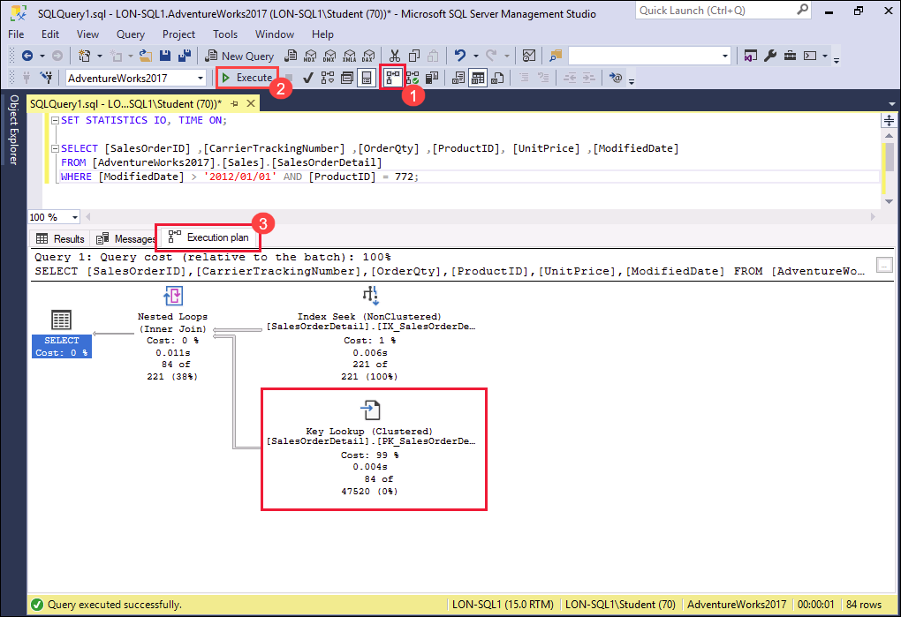

   
   - When reviewing the execution plan, you will note there is a **Key Lookup**. If you hover your mouse over the icon, you will see that the properties indicate it is performed for each row retrieved by the query. You can see the execution plan is performing a **Key Lookup** operation.
    

      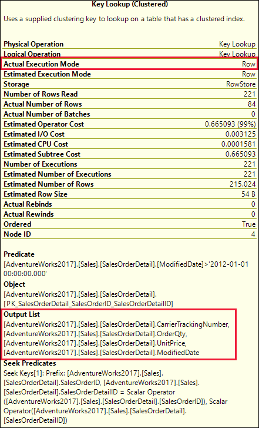
    

     >  **Note:** the columns in the **Output List** section. How would you improve this query?

    - To identify what index needs to be altered in order to remove the key lookup, you need to examine the index seek above it. Hover over the index seek operator with your mouse and the properties of the operator will appear.

        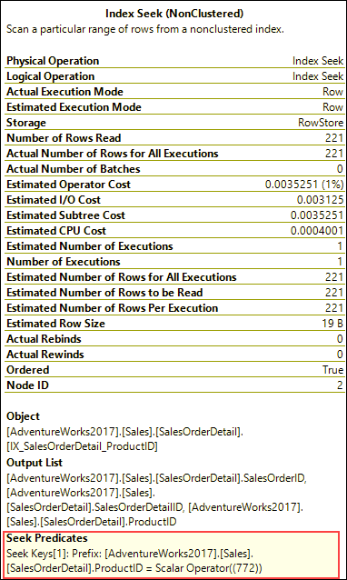
     

1. **Key Lookups** can be removed by adding a covering index that includes all fields being returned or searched in the query. In this example the index only uses the **ProductID** column. Fix the **Key Lookup** and rerun the query to see the new plan. **Copy and paste the code below into the same query window.**

    ```sql
    CREATE NONCLUSTERED INDEX [IX_SalesOrderDetail_ProductID] ON [Sales].[SalesOrderDetail]
    ([ProductID] ASC)
    ```

      - If we add the **Output List** fields to the index as included columns, then the **Key Lookup** will be removed. Since the index already exists you either have to DROP the index and recreate it, or set the **DROP_EXISTING=ON** in order to add the columns. Note that the **ProductID** column is already part of the index and does not need to be added as an included column. There is another performance improvement we can make to the index by adding the **ModifiedDate**. **Replace the below code with the earlier code  Copy and paste the code below into the same query window.**

        ```sql
        CREATE NONCLUSTERED INDEX [IX_SalesOrderDetail_ProductID]
        ON [Sales].[SalesOrderDetail] ([ProductID],[ModifiedDate])
        INCLUDE ([CarrierTrackingNumber],[OrderQty],[UnitPrice])
        WITH (DROP_EXISTING = on);
        GO
        ```

1. **Rerun** the query from step 1 under **Generate actual execution plan** and then **rerun previous step again**. Make note of the changes to the logical reads and execution plan changes. The plan now only needs to use the nonclustered index we created.

      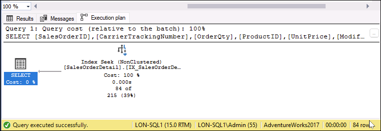

## Use Query Store to detect and handle regression

Next you'll run a workload to generate query statistics for query store, examine **Top Resource Consuming Queries** report to identify poor performance, and see how to force a better execution plan.

1. Select **New Query**. Copy and paste the following T-SQL code into the query window. Select **Execute** to execute this query.

    This script will enable the Query Store feature for AdventureWorks2017 database and sets the database to Compatibility Level 100.

    ```sql
    USE [master];
    GO

    ALTER DATABASE [AdventureWorks2017] SET QUERY_STORE = ON;
    GO

    ALTER DATABASE [AdventureWorks2017] SET QUERY_STORE (OPERATION_MODE = READ_WRITE);
    GO

    ALTER DATABASE [AdventureWorks2017] SET COMPATIBILITY_LEVEL = 100;
    GO
    ```

    Changing the compatibility level is like moving the database back in time. It restricts the features SQL server can use to those that were available in SQL Server 2008.

1. Select the **File** > **Open** > **File** menu in SQL Server Management Studio.

1. Navigate to the **C:\LabFiles\Monitor and optimize\CreateRandomWorkloadGenerator.sql** file.

1. Once opened into SQL Server Management Studio, select **Execute** or press <kbd>F5</kbd> to execute the query.

1. In a **New query editor**, open the file **C:\LabFiles\Monitor and optimize\ExecuteRandomWorkload.sql**, and select **Execute** or press <kbd>F5</kbd> to execute the query.

1. After the execution completes, run the script a second time to create additional load on the server. Leave the query tab open for this query.

1. Copy and paste the code below into a new query window and execute it by selecting **Execute** or press <kbd>F5</kbd>. 

    This script changes the database compatibility mode to SQL Server 2019 (**150**). All the features and improvements since SQL Server 2008 will now be available to the database.

    ```sql
    USE [master];
    GO

    ALTER DATABASE [AdventureWorks2017] SET COMPATIBILITY_LEVEL = 150;
    GO
    ```

1. Navigate back to the query tab from **ExecuteRandomWorkload.sql** file, and re-execute it.

## Examine Top Resource Consuming Queries report

1. In order to view the Query Store node you will need to refresh the AdventureWorks2017 database in SQL Server Management Studio. **Right click (1)** on database name and choose select **Refresh (2)**. You will then see the **Query Store (3)** node under the database.

      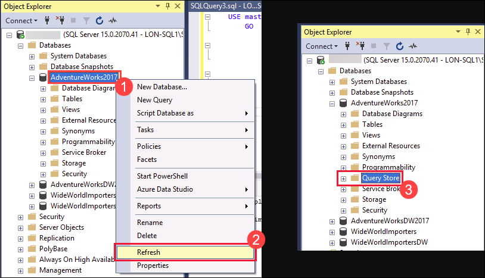

1. Expand the **Query Store (1)** node to view all the reports available. Select the and double click **Top Resource Consuming Queries (2)** report.

      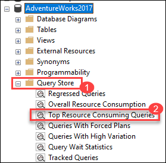

1. The report will open as shown below. On the right, select **Configure**.

      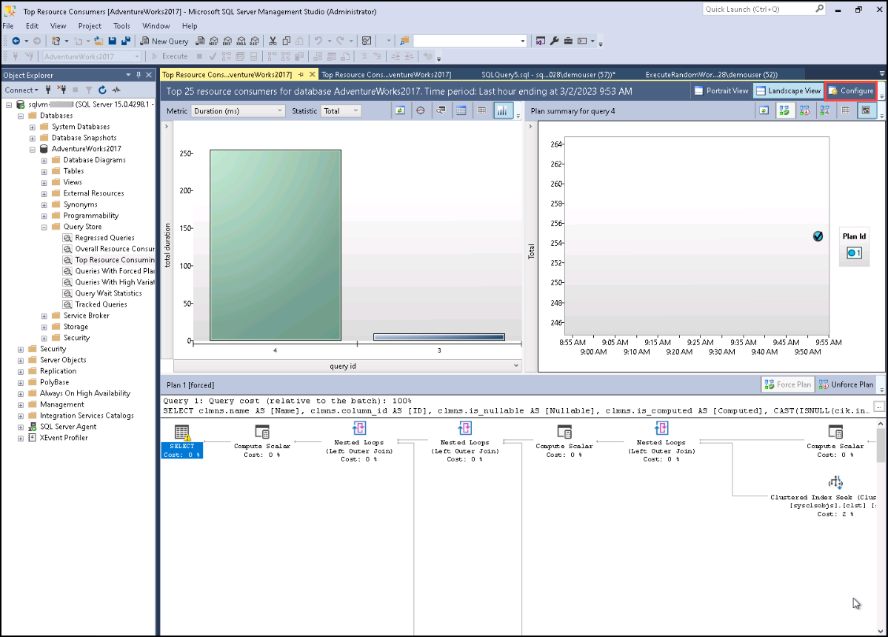

1. In the configuration screen, change the filter for the **minimum number of query plans to 2 (1)**. Then select **OK (2)**.

      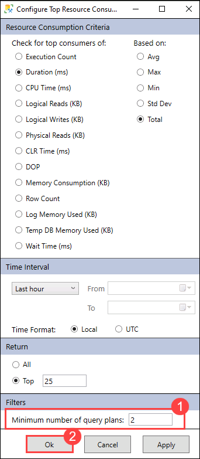

1. Choose the query with the longest duration by selecting the left most bar in the bar chart in the top left portion of the report.

      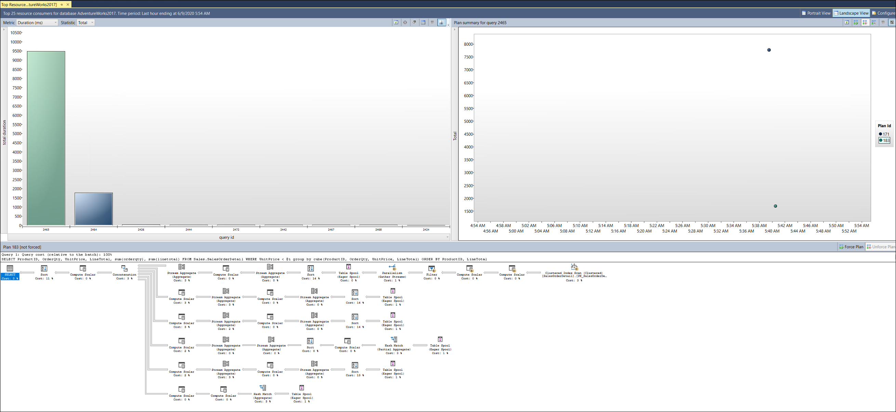

    This will show you the query and plan summary for your longest duration query in your query store.
    
    > **Note:** If you don't see the **Bar chart** then **change the minimum number of query plans to 1 and perform the Next step.**

## Force a better execution plan

1. Navigate to the plan summary portion of the report as shown below. You will note there are one or two execution plans with widely different durations.

      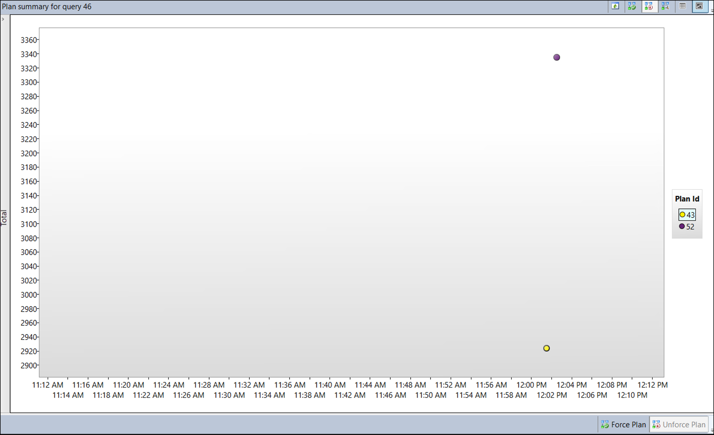

1. Select the Plan ID with the lowest duration (this is indicated by a lower position on the Y-axis of the chart) in the top right window of the report. For example, in the graphic above, it’s *PlanID 43*. Select the plan ID next to the Plan Summary chart (it should be highlighted like in the above screenshot).

   > **Note:** The Plan ID may be different in your lab environment so just select the Plan ID with the lowest duration.

1. Select **Force Plan** under the summary chart. A confirmation window will popup, select **Yes**.

      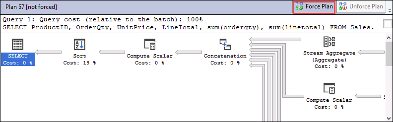

    - Once the plan is forced you will see that the **Forced Plan** is now greyed out and the plan in the plan summary window now has a check mark indicating is it forced.

    - There can be times when the query optimizer can make a poor choice on which execution plan to use. When this happens you can force SQL server to use the plan you want when you know it performs better.

## Use query hints to impact performance

Next you'll run a workload, change the query to use a parameter, apply a query hint to the query, and re-execute it.

Before continuing with the exercise close all the current query windows by selecting the **Window** menu, then select **Close All Documents**. In the popup select **No**.

1. Select **New Query (1)**, then select the **Include Actual Execution Plan (2)** icon before running the query or use <kbd>CTRL</kbd>+<kbd>M</kbd>.

      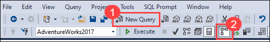

1. Execute the query below. Note that the execution plan shows an index seek operator.

    ```sql
    USE AdventureWorks2017;
    GO

    SELECT SalesOrderId, OrderDate
    FROM Sales.SalesOrderHeader
    WHERE SalesPersonID=288;
    ```

      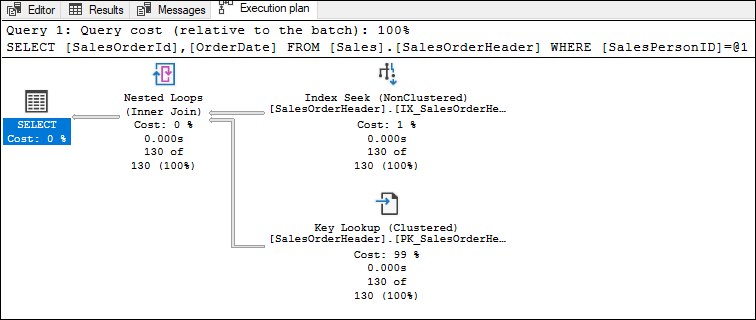

1. In a **New query window**, run the next query. Compare both execution plans.

    ```sql
    USE AdventureWorks2017;
    GO

    SELECT SalesOrderId, OrderDate
    FROM Sales.SalesOrderHeader
    WHERE SalesPersonID=277;
    ```

    The only change this time is that the SalesPersonID value is set to 277. Note the Clustered Index Scan operation in the execution plan.

    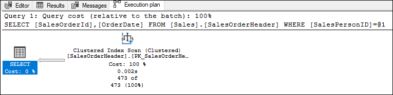

   - As we can see, based on the index statistics the query optimizer has chosen a different execution plan because of the different values in the `WHERE` clause.
  
   - Why do we have different plans if we only changed the *SalesPersonID* value?

   - This query uses a constant in its `WHERE` clause, the optimizer sees each of these queries as unique and generates a different execution plan each time.

## Change the query to use a variable and use a Query Hint

1. Change the query to use a variable value for SalesPersonID.

1. Use the T-SQL **DECLARE** statement to declare <strong>@SalesPersonID</strong> so you can pass in a value instead of hard-code the value in the **WHERE** clause. You should ensure that the data type of your variable matches the data type of the column in the target table to avoid implicit conversion.

    ```sql
    USE AdventureWorks2017;
    GO

    SET STATISTICS IO, TIME ON;

    DECLARE @SalesPersonID INT;

    SELECT @SalesPersonID = 288;

    SELECT SalesOrderId, OrderDate
    FROM Sales.SalesOrderHeader
    WHERE SalesPersonID= @SalesPersonID;
    ```

     - If you examine the execution plan, you will **note** it is using an index scan to get the results. The query optimizer couldn't make good optimizations because it can't know the value of the local variable until runtime.

1. You can help the query optimizer to make better choices by providing a query hint. Rerun the above query with `OPTION (RECOMPILE)`:

    ```sql
    USE AdventureWorks2017
    GO

    SET STATISTICS IO, TIME ON;

    DECLARE @SalesPersonID INT;

    SELECT @SalesPersonID = 288;

    SELECT SalesOrderId, OrderDate
    FROM Sales.SalesOrderHeader
    WHERE SalesPersonID= @SalesPersonID
    OPTION (RECOMPILE);
    ```

   > **Note:** the query optimizer has been able to choose a more efficient execution plan. The `RECOMPILE` option causes the query compiler to replace the variable with its value.

    Comparing the statistics, you can see in the message tab that the difference between logical reads is **68%** more (689 versus 409) for the query without the query hint.

In this exercise, you've learned how to identify query problems, and how to fix it to improve the query plan.
