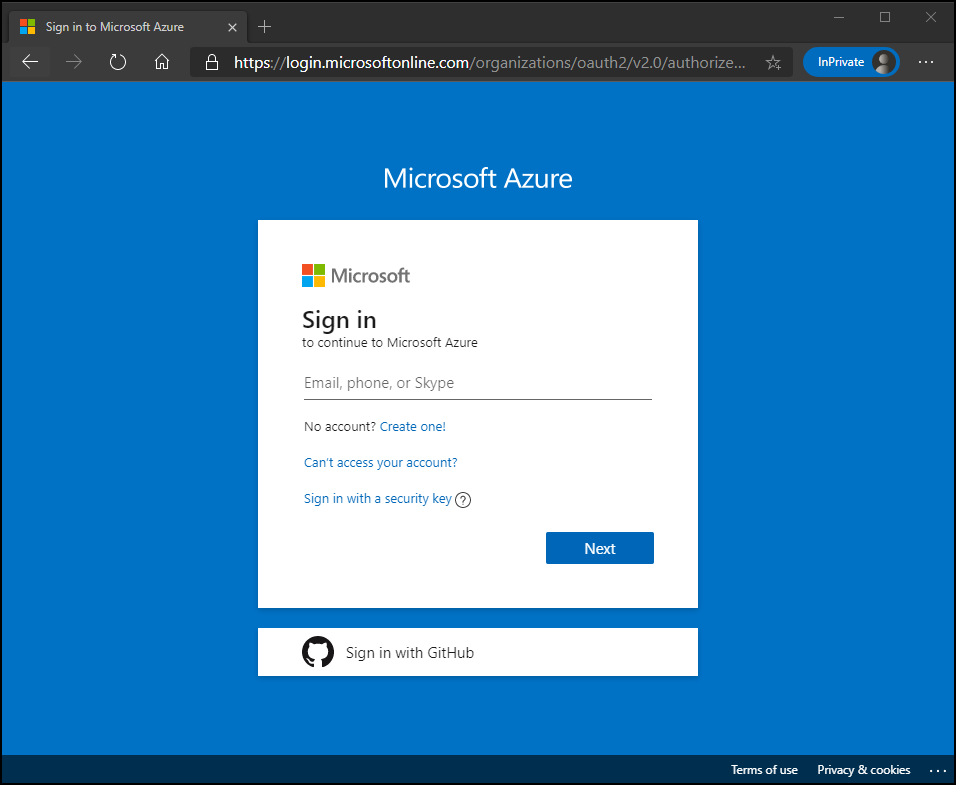
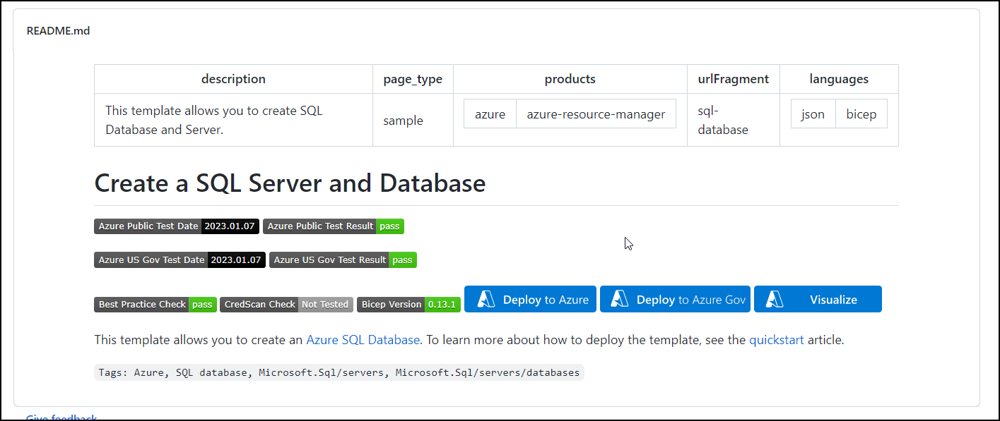
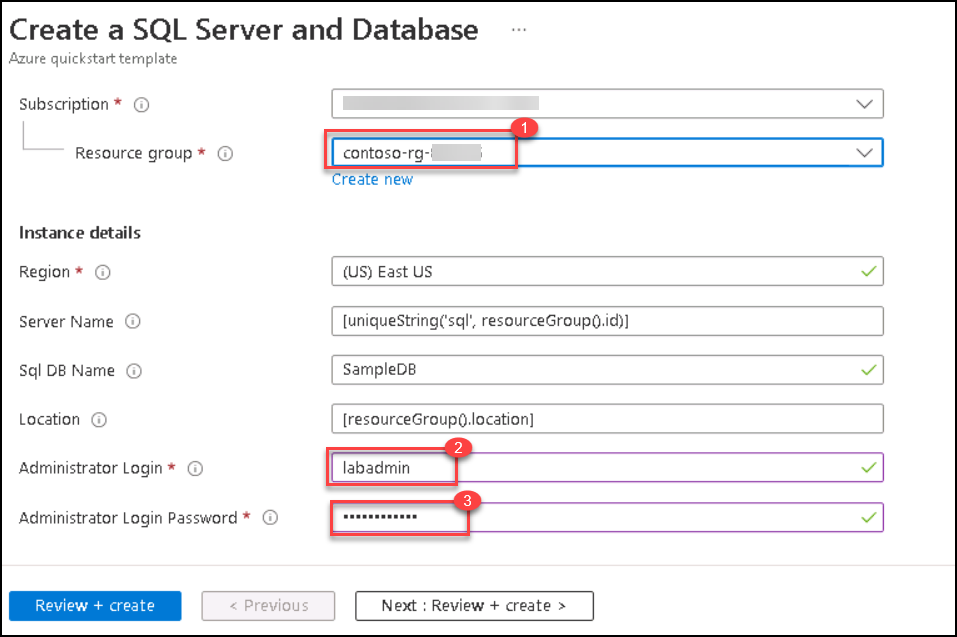
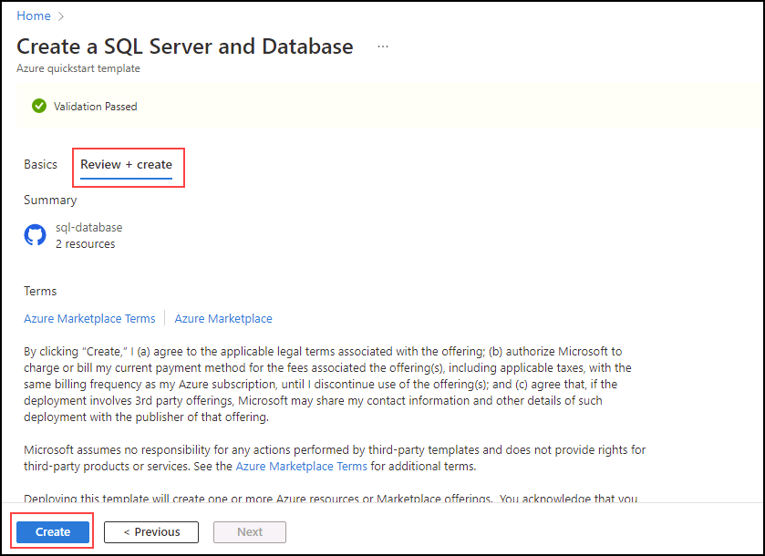
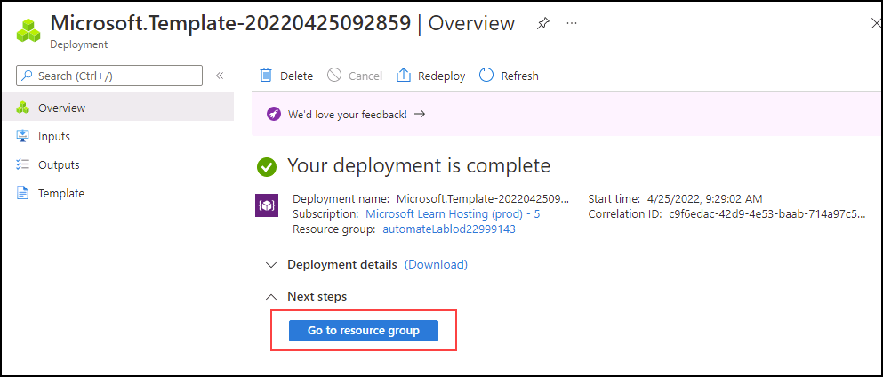

# Deploy an Azure SQL Database from a template

You've been hired as a Senior Data Engineer to help automate day to day operations of database administration. This automation is to help ensure that the databases for AdventureWorks continue to operate at peak performance and provide methods for alerting based on certain criteria. AdventureWorks uses SQL Server in both Infrastructure as a Service (IaaS) and Platform as a Service (PaaS) offerings.

## Explore Azure Resource Manager template

1. In the lab virtual machine, double click on the Azure portal shortcut on the desktop [https://portal.azure.com](https://portal.azure.com/), and sign in using the Azure **Username** <inject key="AzureAdUserEmail"></inject> and **Password** <inject key="AzureAdUserPassword"></inject>
  
  
  
2. In Microsoft Edge, open a new tab and navigate to the following path in a GitHub repository, which contains an ARM template to deploy a SQL Database resource

    ```
    https://github.com/Azure/azure-quickstart-templates/tree/master/quickstarts/microsoft.sql/sql-database
    ```

1. Right-click **azuredeploy.json**, and select **Open link in new tab** to view the ARM template, which should look similar to this:

    ```JSON
    {
    "$schema": "https://schema.management.azure.com/schemas/2019-04-01/deploymentTemplate.json#",
    "contentVersion": "1.0.0.0",
    "parameters": {
        "serverName": {
        "type": "string",
        "defaultValue": "[uniqueString('sql', resourceGroup().id)]",
        "metadata": {
            "description": "The name of the SQL logical server."
        }
        },
        "sqlDBName": {
        "type": "string",
        "defaultValue": "SampleDB",
        "metadata": {
            "description": "The name of the SQL Database."
        }
        },
        "location": {
        "type": "string",
        "defaultValue": "[resourceGroup().location]",
        "metadata": {
            "description": "Location for all resources."
        }
        },
        "administratorLogin": {
        "type": "string",
        "metadata": {
            "description": "The administrator username of the SQL logical server."
        }
        },
        "administratorLoginPassword": {
        "type": "securestring",
        "metadata": {
            "description": "The administrator password of the SQL logical server."
        }
        }
    },
    "variables": {},
    "resources": [
        {
        "type": "Microsoft.Sql/servers",
        "apiVersion": "2020-02-02-preview",
        "name": "[parameters('serverName')]",
        "location": "[parameters('location')]",
        "properties": {
            "administratorLogin": "[parameters('administratorLogin')]",
            "administratorLoginPassword": "[parameters('administratorLoginPassword')]"
        },
        "resources": [
            {
            "type": "databases",
            "apiVersion": "2020-08-01-preview",
            "name": "[parameters('sqlDBName')]",
            "location": "[parameters('location')]",
            "sku": {
                "name": "Standard",
                "tier": "Standard"
            },
            "dependsOn": [
                "[resourceId('Microsoft.Sql/servers', concat(parameters('serverName')))]"
            ]
            }
        ]
        }
    ]
    }
    ```

1. Review and observe the JSON properties.

1. Close the **azuredeploy.json** tab and return to the tab containing the **sql-database** GitHub folder. Scroll down and select **Deploy to Azure**. Enter **Username** and **Password** from the **Environment Details** Tab.

    

1. The **Create a SQL Server and Database** quickstart template page will open on Azure portal, with resource details partially filled in from the ARM template. Complete the blank fields with the information below:

    - **Resource group:** contoso-rg-<inject key="Deployment-id" enableCopy="false" />
    - **Administrator Login:** labadmin
    - **Administrator Login Password:** &lt;enter a strong password&gt;
    
    
    
1. Select **Review + create**, and then select **Create**. Your deployment will take 5 minutes or so to deploy.

    

1. When deployment has completed, select **Go to resource group**. You'll be taken to your Azure Resource Group, which contains a randomly named **SQL Server** resource created by the deployment.

    

You've just seen how, with a single click on an Azure Resource Manager template link, you can easily create both an Azure SQL server and database.
