# Create a CPU status alert for a SQL Server on Azure

**Estimated Time: 30 minutes**

You have been hired as a Senior Data Engineer to help automate day to day operations of database administration. This automation is to help ensure that the databases for AdventureWorks continue to operate at peak performance as well as provide methods for alerting based on certain criteria.

## Create an alert when a CPU exceeds an average of 80 percent

Once the environment is provisioned, a virtual machine (JumpVM) and lab guide will get loaded in your browser. Use this virtual machine throughout the workshop to perform the lab. 

1. Login to Azure Portal in the JumpVM, click on the Azure portal shortcut of the Microsoft Edge browser which is created on the desktop.

   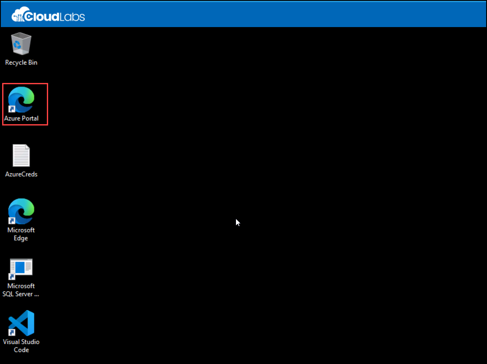
  
2. On the Sign in to Microsoft Azure tab you will see the login screen, in that enter the following email/username, and click on Next.

3. If you see the pop-up Stay Signed in?, click No.

4. If you see the pop-up You have free Azure Advisor recommendations!, close the window to continue the lab.

5. If a Welcome to Microsoft Azure popup window appears, click **Maybe Later** to skip the tour.

6. In the search bar at the top of the Azure portal, type **SQL**, and select **SQL databases**. Select the **AdventureWorksLT** database name listed.

   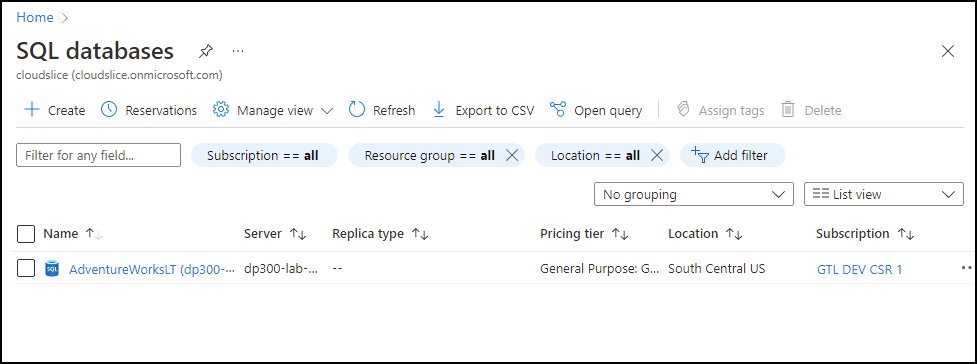

7. On the main blade for the **AdventureWorksLT** database, navigate down to the monitoring section. Select **Alerts**.

   

8. Select **Create alert rule**.

   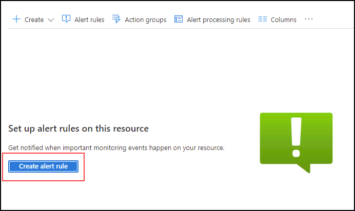

9. In the **Select a signal** slide out, select **CPU percentage**.

   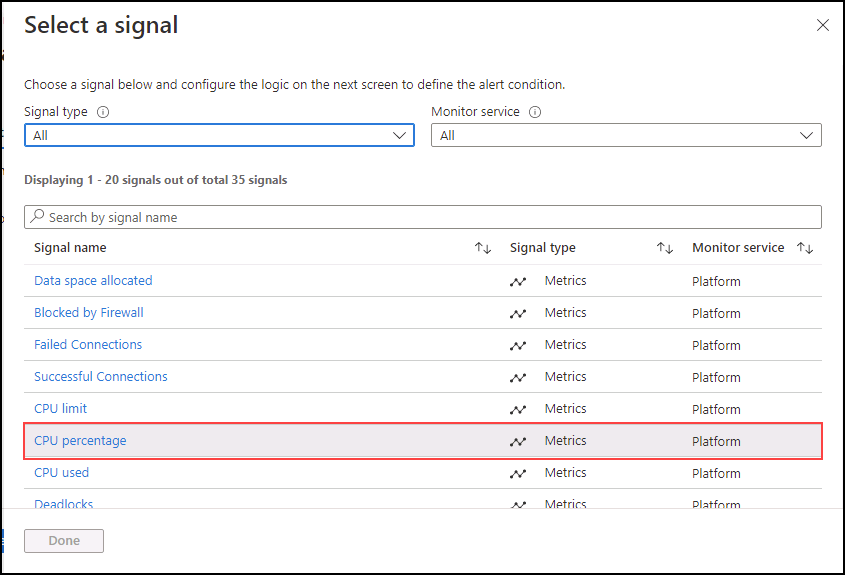

10. In the **Create an alert rule** slide out, select **Static (1)** for the **Threshold** property. Then check that the **Aggregation ** type is **Average (2)**, the **Operator** property is **Greater than (3)** Then in **Threshold value** enter a value of **80 (4)**. Select **Next:Actions (5)**.

    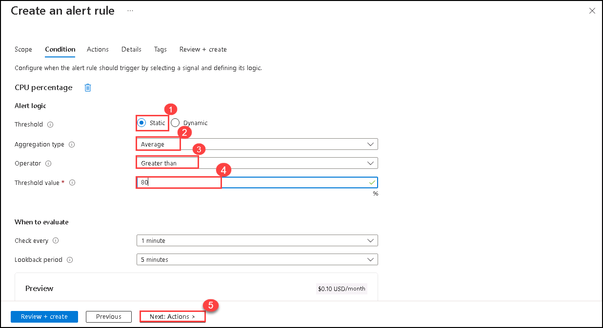

11. In the **Actions** tab, select **Create action group**.

    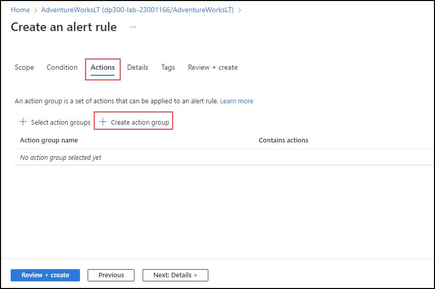

12. On the **Create action group** screen, type **emailgroup** in the **Action group name** field, and then select **Next: Notifications**.

    

13. On the **Notifications** tab, enter the following information:

    - **Notification type:** Email/SMS message/Push/Voice
        - **Note:** When you select this option, a Email/SMS message/Push/Voice flyout will appear. Check the Email property and type the Azure username you signed in with.
    - **Name:** DemoLab 
    - Select **Review + create**, then select **Create**.
        - **Note:** Wait till action group created successfully then move to next step.

    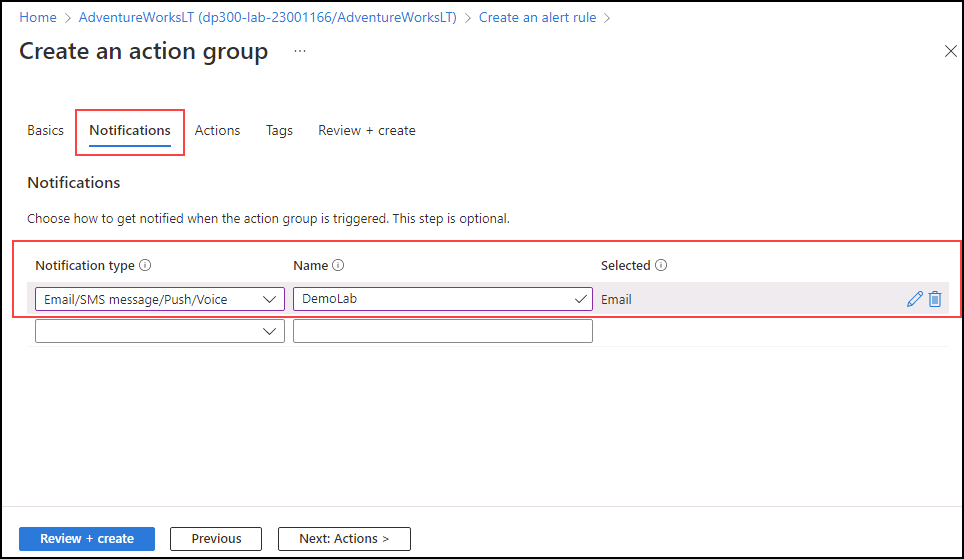
    
14. On the **Create an alert rule** screen, select **Details** tab, enter Alert rule name as **emailrule (1)**, then select **Review + create (2)**.
    
    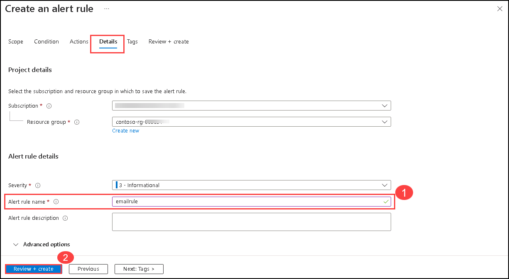

15. On the **Review + create** tab, Select **Create**.

    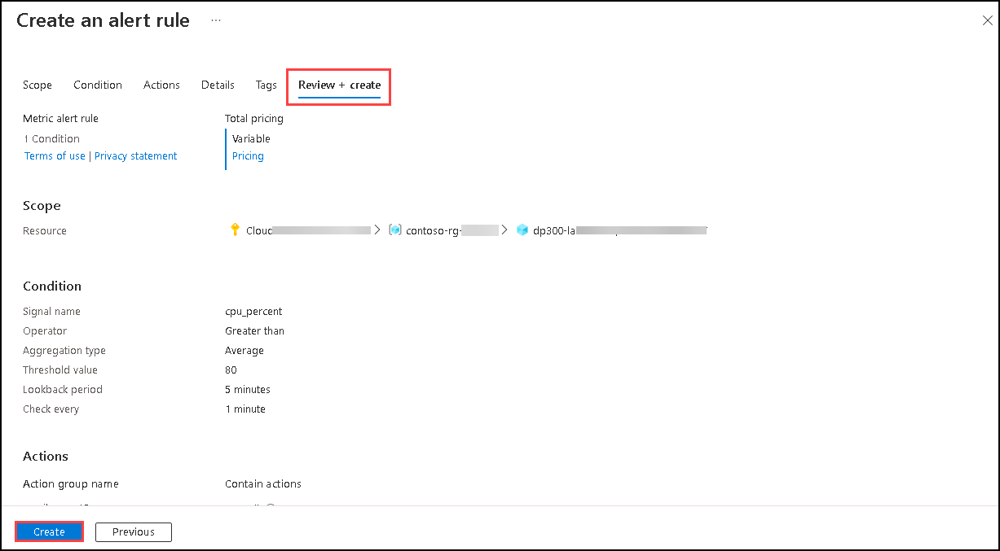

16. An email like this is sent to the email address that you entered, once the rule is created.

    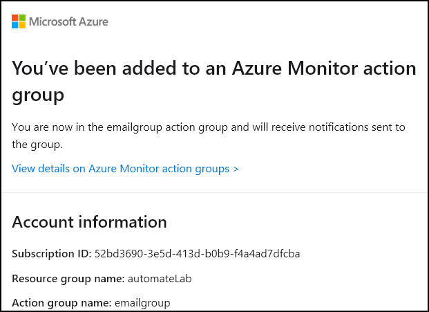

    With the alert in place, if the CPU usage on average exceeds 80%, an email like this is sent.

    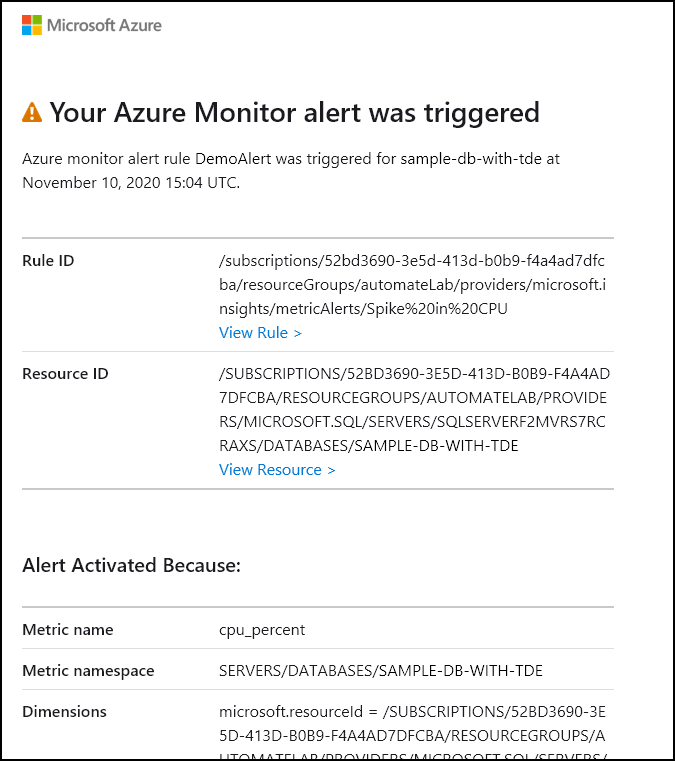

Alerts can send you an email or call a web hook when some metric (for example database size or CPU usage) reaches a threshold you define. You've just seen how you can easily configure alerts for Azure SQL Databases.
