# Backup to URL  

As a DBA for AdventureWorks, you need to back up a database to a URL in Azure and restore it from Azure blob storage after a human error has occurred.

## Restore a database

1. Open File explorer and verify that the database backup file is present under **C:\LabFiles\HADR** path on the lab virtual machine.

    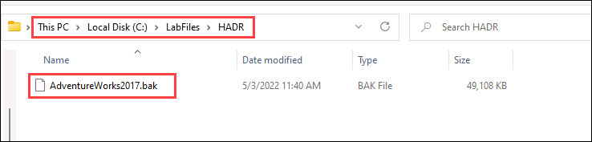

1. Select the Windows Start button and type **SSMS (1)**. Select **Microsoft SQL Server Management Studio 19 (2)** from the list.  

    

1. When SSMS opens, notice that the **Connect to Server** dialog will be pre-populated with the default instance name with **sqlvm-<inject key="DeploymentID" enableCopy="false" /> (1)**. Select **Connect (2)**.

    

1. Select the **Databases (1)** folder, and then **New Query (2)**.

    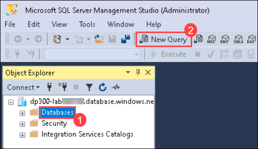

1. In the **New query window**, copy and paste the below T-SQL into it. Execute the query to restore the database.

    ```sql
    RESTORE DATABASE AdventureWorks2017
    FROM DISK = 'C:\LabFiles\HADR\AdventureWorks2017.bak'
    WITH RECOVERY,
          MOVE 'AdventureWorks2017' 
            TO 'C:\LabFiles\HADR\AdventureWorks2017.mdf',
          MOVE 'AdventureWorks2017_log'
            TO 'C:\LabFiles\HADR\AdventureWorks2017_log.ldf';
    ```

1. You should see a successful message after the restore is complete.

    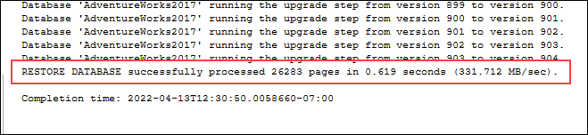

## Configure Backup to URL

1. From the lab virtual machine, start a browser session and navigate to [https://portal.azure.com](https://portal.azure.com/). Connect to the Portal using the Azure **Username** <inject key="AzureAdUserEmail"></inject> and **Password**  <inject key="AzureAdUserPassword"></inject>

    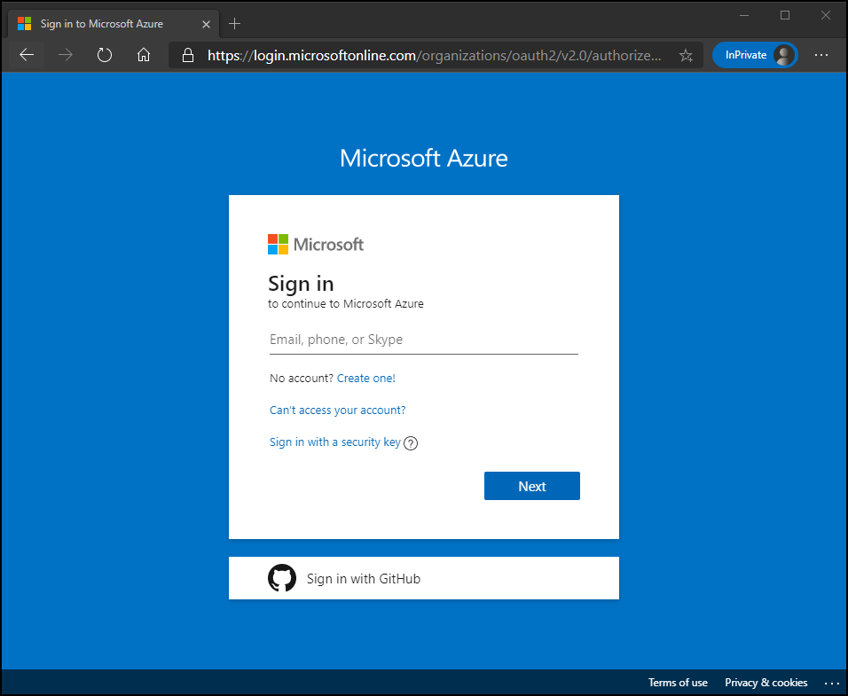

1. Open a **Cloud Shell** prompt by selecting the icon shown below.

    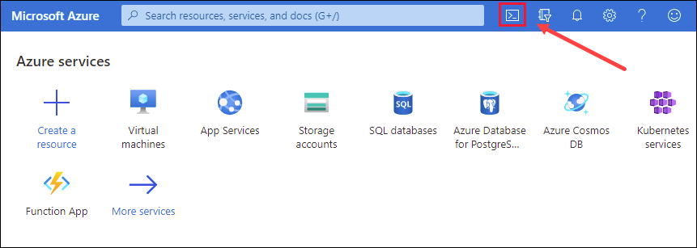

1. At the bottom half of the portal, you may see a message welcoming you to the Azure Cloud Shell, if you have not yet used a Cloud Shell. Select **Bash**.

    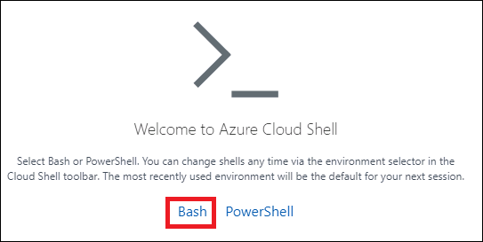

1. If you have not previously used a Cloud Shell, you must configure a storage. Select **Show advanced settings** (Use existing subscription).

    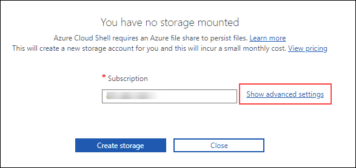

1. Use the existing **Resource group** as **contoso-rg-<inject key="DeploymentID" enableCopy="false" />(1)** and specify new names for **Storage account** as **dp300storage<inject key="DeploymentID" enableCopy="false" />(2)** and **File share** as **dp300fileshare (3)**, as shown in the dialog below. Then select **Create storage (4)**.

    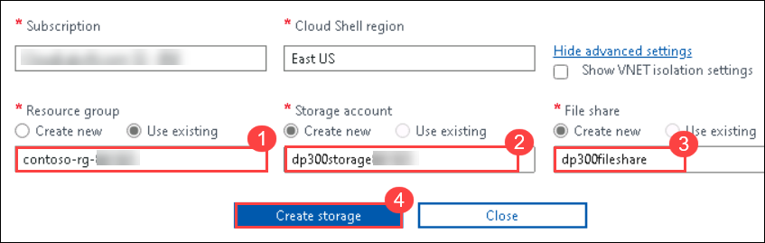

1. Once complete, you will see a prompt similar to the one below. Verify that the upper left corner of the Cloud Shell screen shows **Bash**.

    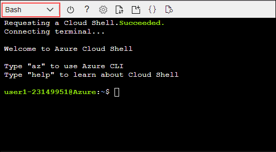

1. Create a new storage account from the CLI using by executing the following command in Cloud Shell.

    > **NOTE:** Replace BACKUP_STORAGE_NAME with **dp300backupstorage<inject key="DeploymentID" enableCopy="false" />** and RESOURCE_GROUP_NAME with **contoso-rg-<inject key="DeploymentID" enableCopy="false" />**.

    ```bash
    az storage account create -n "BACKUP_STORAGE_NAME" -g "RESOURCE_GROUP_NAME" --kind StorageV2 -l eastus2
    ```

    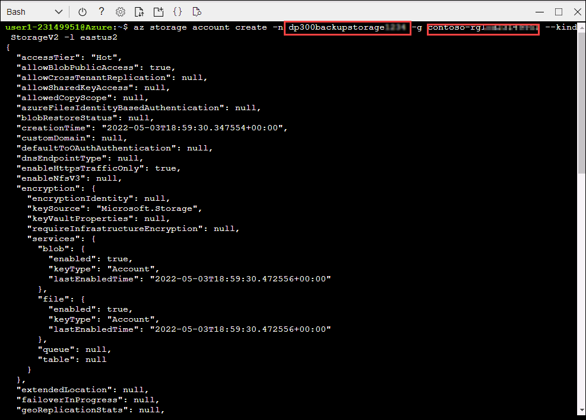

1. Next you will get the keys for your storage account, which you will use in subsequent steps. Execute the following code in Cloud Shell: 
 
   > **NOTE:** Replace BACKUP_STORAGE_NAME with **dp300backupstorage<inject key="DeploymentID" enableCopy="false" />** and RESOURCE_GROUP_NAME with **contoso-rg-<inject key="DeploymentID" enableCopy="false" />**.
   
    ```bash
    az storage account keys list -g RESOURCE_GROUP_NAME -n BACKUP_STORAGE_NAME
    ```

    Your account key will be in the results of the above command. Copy the returned value for **key1** (without the double quotes) in a notepad as shown here:

    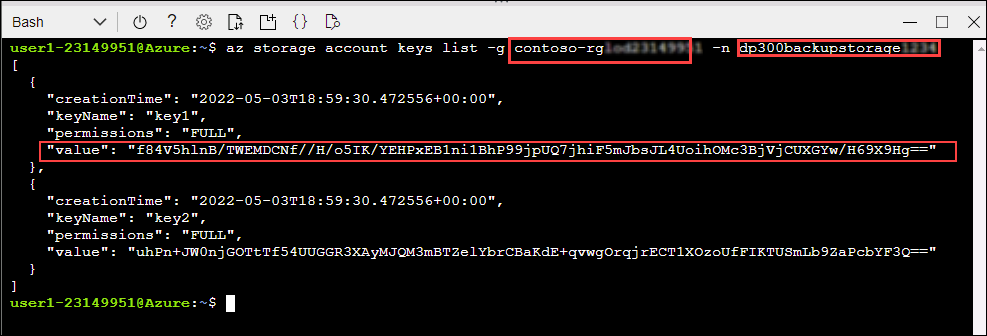

1. Backing up a database in SQL Server to a URL uses container within a storage account. You will create a container specifically for backup storage in this step. To do this, execute the commands below.

   > **NOTE:** Replace BACKUP_STORAGE_NAME with **dp300backupstorage<inject key="DeploymentID" enableCopy="false" />** and STORAGE_KEY with the value of **key1** that you have copied in the notepad in the previous step.

    ```bash
    az storage container create --name "backups" --account-name "BACKUP_STORAGE_NAME" --account-key "STORAGE_KEY" --fail-on-exist
    ```

    The output should return **true**.

    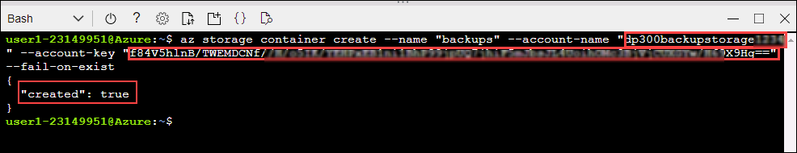

1. To verify if the container backups has been created properly, execute:

    ```bash
    az storage container list --account-name "BACKUP_STORAGE_NAME" --account-key "STORAGE_KEY"
    ```

   > **NOTE:** Replace BACKUP_STORAGE_NAME with **dp300backupstorage<inject key="DeploymentID" enableCopy="false" />** and STORAGE_KEY with the value of **key1** that you have copied in the notepad. The output should return something similar to below:

    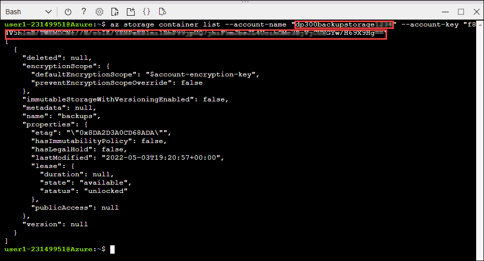

1. A shared access signature (SAS) at the container level is required for security. This can be done via Cloud Shell or PowerShell. Execute the following:

    ```bash
    az storage container generate-sas -n "backups" --account-name "BACKUP_STORAGE_NAME" --account-key "STORAGE_KEY" --permissions "rwdl" --expiry "2023-12-31T00:00Z" -o tsv
    ```

   > **NOTE:** Replace BACKUP_STORAGE_NAME with **dp300backupstorage<inject key="DeploymentID" enableCopy="false" />** and STORAGE_KEY with the value of **key1** that you have copied in the notepad.

    The output should return something similar to below. Copy the whole shared access signature and paste it in **Notepad**, it will be used in the next task.

    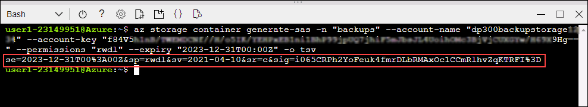

## Create credential

Now that the functionality is configured, you can generate a backup file as a blob in Azure Storage Account.

1. Move back to **SQL Server Management Studio (SSMS)** and select **New Query**.

1. Create the credential that will be used to access storage in the cloud with the following Transact-SQL. Repalce the following values, then select **Execute**.

   >**NOTE:** Replace **<storage_account_name>** with **dp300backupstorage<inject key="DeploymentID" enableCopy="false" />**. Replace the **<key_value>** with the **SAS** that you have copied in the notepad. the value generated at the end of the previous task in this format:
   
       `'se=2023-12-31T00%3A00Z&sp=rwdl&sv=2018-11-09&sr=csig=rnoGlveGql7ILhziyKYUPBq5ltGc/pzqOCNX5rrLdRQ%3D'`
       
       
       
      ```sql
    IF NOT EXISTS  
    (SELECT * 
        FROM sys.credentials  
        WHERE name = 'https://<storage_account_name>.blob.core.windows.net/backups')  
    BEGIN
        CREATE CREDENTIAL [https://<storage_account_name>.blob.core.windows.net/backups]
        WITH IDENTITY = 'SHARED ACCESS SIGNATURE',
        SECRET = '<key_value>'
    END;
    GO  
    ```
  
    
      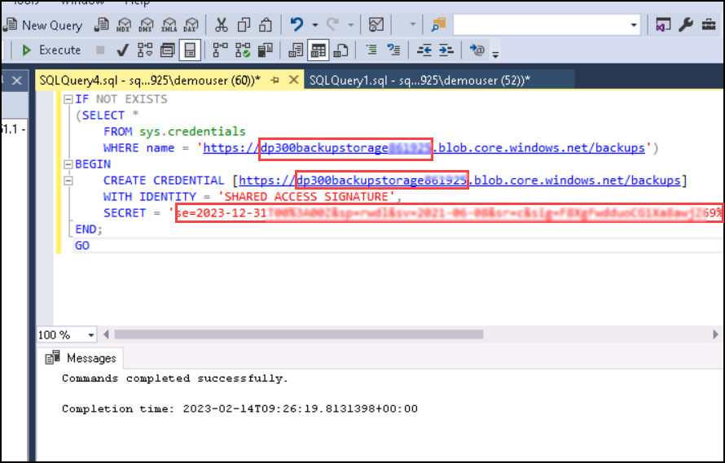
   
1. You can check if the credential was created successfully by navigating to **Security -> Credentials** on Object Explore.

    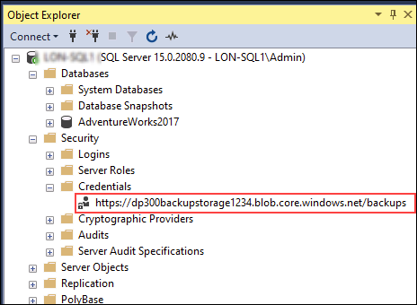

1. If you mistyped and need to recreate the credential, you can drop it with the following command, making sure to change the name of the storage account. (Only run this command if you need to go back and recreate the credential).  select **New Query**, then paste and execute the following query.

   > **Note:** Skip this step if you have already created the credentials correctly.

    ```sql
    DROP CREDENTIAL [https://<storage_account_name>.blob.core.windows.net/backups]  
    ```

## Backup to URL

1. Back up the database **AdventureWorks2017** to Azure with the following command in Transact-SQL.  select **New Query**, then paste and execute the following query:

    ```sql
    BACKUP DATABASE AdventureWorks2017   
    TO URL = 'https://<storage_account_name>.blob.core.windows.net/backups/AdventureWorks2017.bak';
    GO 
    ```

    > **Note:** Replace <storage_account_name> with **dp300backupstorage<inject key="DeploymentID" enableCopy="false" />**. The output should return something similar to below.

    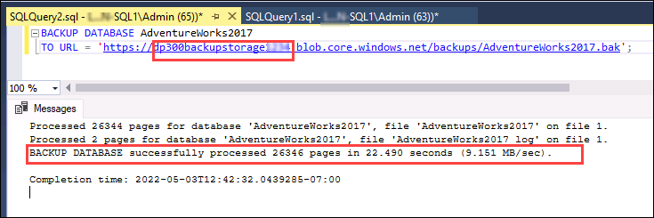

    If something was configured incorrectly, you will see an error message similar to the following:

    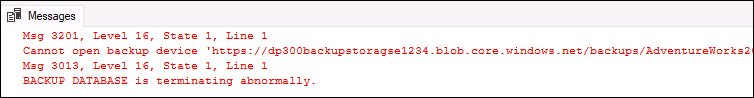

    If an error occurs, check that you did not mistype anything during the credential creation, and that everything was created successfully.

## Validate the backup through Azure CLI

To see that the file is actually in Azure, you can use Storage Explorer or Azure Cloud Shell.

1. Navigate back to [https://portal.azure.com](https://portal.azure.com/). If not connected then connect to the Portal using the Azure **Username** and **Password** provided on the **Environment Details** tab for this lab virtual machine.

1. Re-open the bash shell window and run this Azure CLI command:

    ```bash
    az storage blob list -c "backups" --account-name "BACKUP_STORAGE_NAME" --account-key "KEY1" --output table
    ```

    > **NOTE:** Replace BACKUP_STORAGE_NAME with **dp300backupstorage<inject key="DeploymentID" enableCopy="false" />** and KEY1 with the value of **key1** that you have copied in the notepad.

    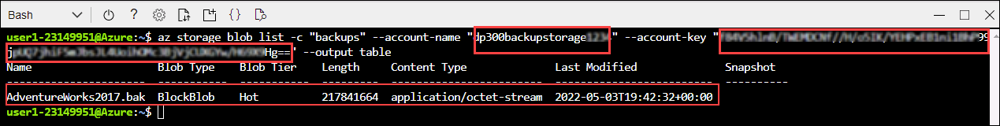

    We can confirm the backup file was generated successfully.

## Validate the backup through Storage Explorer

1. To use the Storage Explorer (preview), from the home page in the Azure portal select **Storage accounts**.

    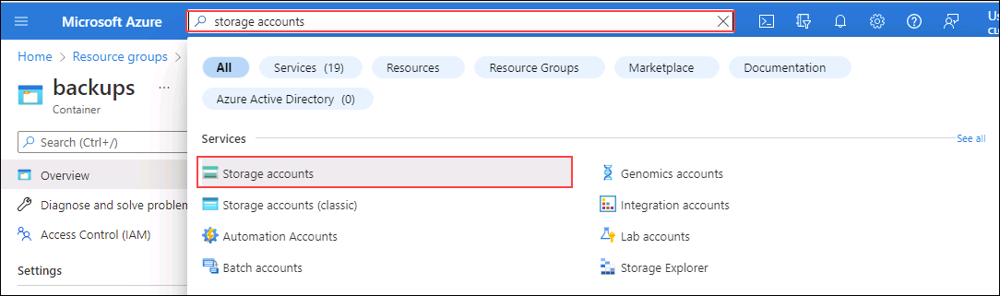

1. Select the backup storage account name you created for the backups.

   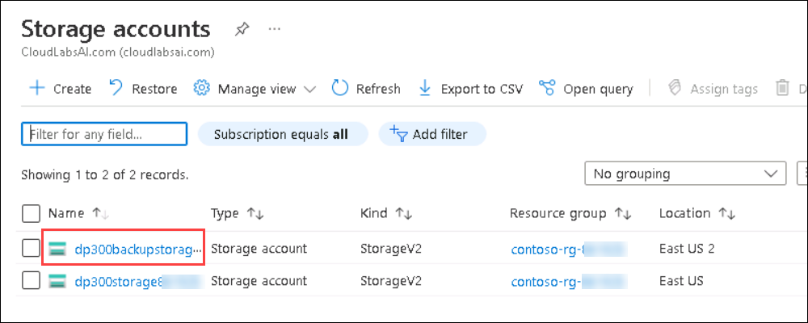

1. In the left navigation, select **Storage browser (preview) (1)**. Expand **Blob containers (2)**.

    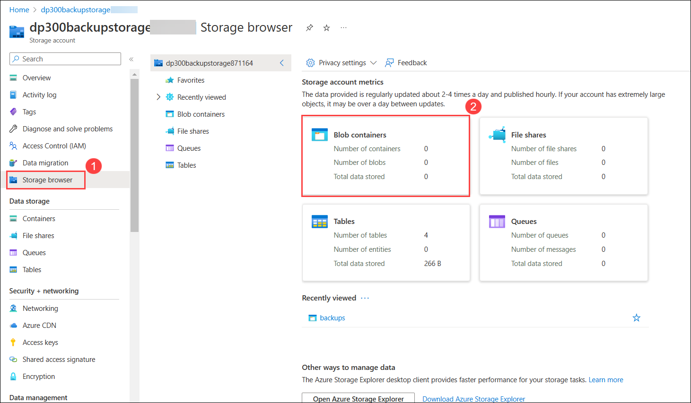

1. Select **backups**.

    

1. Note that the backup file is stored in the container.

    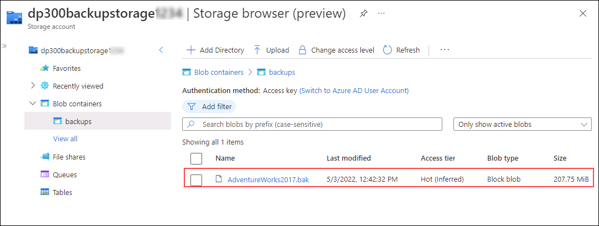

## Restore from URL

This task will show you how to restore a database from an Azure blob storage.

1. Navigate back to **SQL Server Management Studio (SSMS)**,  select **New Query**, then paste and execute the following query.

    ```sql
    USE AdventureWorks2017;
    GO
    SELECT * FROM Person.Address WHERE AddressId = 1;
    GO
    ```

    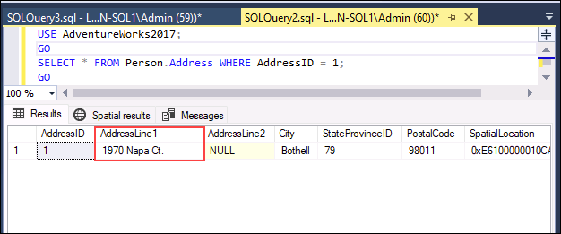

1. Run this command to change the name of that customer. select **New Query**, then paste and execute the following query

    ```sql
    UPDATE Person.Address
    SET AddressLine1 = 'This is a human error'
    WHERE AddressId = 1;
    GO
    ```

1. Re-run **Step 1** to verify that the address has been changed. Now imagine if someone had changed thousands or millions of rows without a WHERE clause – or the wrong WHERE clause. One of the solutions involves restoring the database from the last available backup.

    

1. To restore the database to get it back to where it was before the customer name was mistakenly changed, select **New Query**, then paste and execute the following query.

   > **Note:** **SET SINGLE_USER WITH ROLLBACK IMMEDIATE** syntax the open transactions will all be rolled back. This can prevent the restore failing due to active connections.

    ```sql
    USE [master]
    GO

    ALTER DATABASE AdventureWorks2017 SET SINGLE_USER WITH ROLLBACK IMMEDIATE
    GO

    RESTORE DATABASE AdventureWorks2017 
    FROM URL = 'https://<storage_account_name>.blob.core.windows.net/backups/AdventureWorks2017.bak'
    GO

    ALTER DATABASE AdventureWorks2017 SET MULTI_USER
    GO
    ```

    > **NOTE:** Replace <storage_account_name> with **dp300backupstorage<inject key="DeploymentID" enableCopy="false" />**.

     The output should be similar to this:

    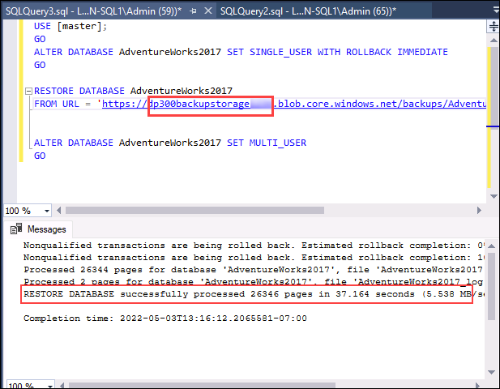

1. Re-run **Step 1** to verify that the customer name has been restored.

    

It is important to understand the components and the interaction to do a backup to or restore from the Azure Blob Storage service.

You have now seen that you can back up a database to a URL in Azure and, if necessary, restore it.
