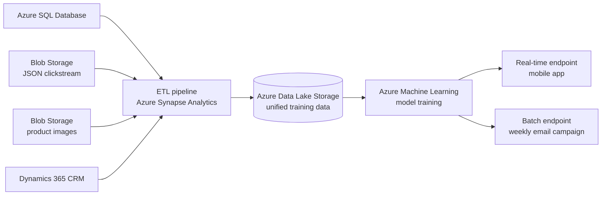

---
lab:
    title: 'Lab 17 – Design a machine learning solution case study'
    module: Design a machine learning training solution
    description: "You'll work through a Contoso Retail case study to design a machine learning training solution for a product recommendation system, making decisions about data strategy, service selection, compute resources, and deployment. By the end, you'll understand how to make informed machine learning design choices that balance cost, performance, complexity, and team skills."
    duration: 15  # duration in minutes
    level: 300 # 100 basic concepts, 200 foundations, 300 practical usage, 400 advanced scenarios, 500 expert design
    islab: no # if this is not a lab that should be listed in the catalog, set to false
    status: 'in-development' # in-development or released
    targetDate: '2099-01-01' # Set to the future date when you expect an in-development lab to be released
---

# Design a machine learning solution - Case study

**Estimated Time: 15 minutes**

> [!NOTE]
> To complete this exercise, read the case study carefully. Apply the design principles you've learned throughout this module to make informed decisions. At the end, you'll test your understanding by answering knowledge check questions.

Welcome to Contoso Retail! You've been hired as the **lead data scientist** to help us design a machine learning training solution.

## Learning objectives

After completing this exercise, you'll be able to:

- Choose a data ingestion strategy for consolidating diverse data sources.
- Select the right Azure service for a machine learning workload based on team skills and scale.
- Provision cost-appropriate compute for model training.
- Design a deployment approach that serves both real-time and batch prediction needs.

## Understand the problem

At Contoso Retail, we operate both physical stores and an e-commerce platform. We want to build a **product recommendation system** that suggests items to customers based on their browsing and purchase history.

Our goal is to increase customer engagement and sales by showing personalized product recommendations:

- In our **mobile app**, customers should see recommendations immediately when they view a product.
- For our **weekly email campaign**, we want to include the top 5 recommended products for each of our **2 million customers**.

Our data engineering team has been collecting customer interaction data for the past **two years**, including:

- Browsing history (products viewed, time spent)
- Purchase history (items bought, purchase dates, amounts)
- Customer demographics (age, location, preferences)
- Product catalog (categories, prices, descriptions, images)

The data is currently stored in multiple systems:

| Data source | Service | Data type | Format | Update frequency |
| --- | --- | --- | --- | --- |
| Transactional data | Azure SQL Database | Structured | Relational tables | Real time |
| Clickstream data | Azure Blob Storage | Semi-structured | JSON files | Hourly |
| Product images | Azure Blob Storage | Unstructured | Image files | As cataloged |
| Customer profiles | Dynamics 365 (CRM) | Structured | CRM records | Ongoing |

We need your help deciding **how to design the machine learning training solution** to build this recommendation system.

## Consider the requirements

As you design the solution, think about these key areas.

### Data ingestion and preparation

- **Consider the data sources**: We have data in Azure SQL Database, Blob Storage (JSON files), Blob Storage (images), and Dynamics 365. How should we consolidate this data?
- **Consider the data format**: The data is in different formats (structured, semi-structured, and unstructured). What format should we use for training?
- **Consider the data pipeline**: Should we build a data ingestion pipeline? If so, how often should it run?

### Machine learning task and service

- **Consider the machine learning task**: What type of machine learning task is this? Classification, regression, recommendation, or something else?
- **Consider the service**: Should we use Azure Machine Learning, Azure Databricks, Microsoft Fabric, or Microsoft Foundry? What factors influence this choice?
- **Consider existing skills**: Our team has strong Python experience but limited Spark knowledge. How does this affect our choice?

### Compute resources

- **Consider the data size**: We have 2 million customers and millions of product interactions. What compute type is appropriate?
- **Consider the model complexity**: Recommendation systems can be simple (collaborative filtering) or complex (deep learning). How does this affect compute needs?
- **Consider cost**: We have a limited budget for this initial phase. Should we start with CPU or GPU? General purpose or memory optimized?

### Deployment requirements

- **Consider the deployment types**: We need both real-time recommendations (mobile app) and batch predictions (email campaign). How should we handle these different needs?
- **Consider the frequency**: Mobile app recommendations need to be instant. Email campaigns are sent weekly. Should we use different endpoints?
- **Consider the scale**: Our app has 100,000 active daily users. Our email campaign targets 2 million customers. How does scale affect our deployment decisions?

## Your task

Based on these requirements, you need to make design decisions about:

1. **Data strategy**: How will you ingest, transform, and store the data for training?
2. **Service selection**: Which Azure service(s) will you use for training, and why?
3. **Compute strategy**: What compute resources will you provision for training?
4. **Deployment approach**: How will you handle both real-time and batch prediction requirements?

Think through each decision carefully, considering trade-offs between cost, performance, complexity, and team capabilities. The knowledge check questions test your ability to make informed design choices based on this scenario.

> [!TIP]
> There's rarely a single "right" answer in solution design. Focus on the trade-offs between cost, performance, complexity, and your team's skills — and be ready to justify your choices.

## Compare your decisions

The following diagram shows one solution architecture that satisfies all of the requirements. Sketch your own design first, then expand the reference solution to compare.

Show reference solution

- **Data strategy**: Use an ETL pipeline (for example, Azure Synapse Analytics or Azure Data Factory) to extract data from Azure SQL Database, Blob Storage, and Dynamics 365 on a schedule, then transform and land it in a unified Azure Data Lake Storage layer in a training-ready format such as Parquet.
- **Service selection**: Use Azure Machine Learning. It supports the Python SDK that matches the team's skills, scales to large datasets, and provides end-to-end tooling for custom model training without requiring Spark expertise.
- **Compute strategy**: Start with CPU general-purpose compute to control cost during the initial phase. Monitor training time, then scale to memory-optimized or GPU compute only if model complexity or data volume requires it.
- **Deployment approach**: Deploy two endpoints from the trained model — a real-time (online) endpoint for instant mobile app recommendations, and a batch endpoint to score all 2 million customers efficiently for the weekly email campaign.

## Knowledge check

Answer the following questions based on the Contoso Retail case study. Select an answer for each question, then expand **Show answer** to check your reasoning.

**1. Based on the Contoso Retail case study, what data ingestion strategy would be most appropriate for consolidating data from Azure SQL Database, Blob Storage (JSON), and Dynamics 365?**

- **A.** Manually export data from each source and combine in Excel before training.
- **B.** Create an ETL pipeline using Azure Synapse Analytics to extract, transform, and load data into a unified storage layer like Azure Data Lake Storage.
- **C.** Keep data in separate sources and connect directly to each during model training.

Show answer

✅ **Correct answer: B.** Create an ETL pipeline using Azure Synapse Analytics to extract, transform, and load data into a unified storage layer like Azure Data Lake Storage.

The data is spread across structured, semi-structured, and unstructured sources that update on different schedules. An automated ETL pipeline consolidates these sources into a single, training-ready layer. Manual export doesn't scale to millions of interactions, and connecting directly to each source during training adds latency and complexity.

**2. For the Contoso Retail recommendation system, which Azure service would be most suitable given the team's Python experience and the need to train on large-scale customer interaction data?**

- **A.** Microsoft Foundry, because it provides pre-built recommendation models.
- **B.** Azure Machine Learning, because it supports the Python SDK, handles large datasets, and provides comprehensive tools for custom model training.
- **C.** Azure Databricks, because it's required for any large-scale machine learning.

Show answer

✅ **Correct answer: B.** Azure Machine Learning, because it supports the Python SDK, handles large datasets, and provides comprehensive tools for custom model training.

The team has strong Python skills but limited Spark knowledge, which makes Azure Machine Learning a better fit than Azure Databricks. Azure Databricks is Spark-based and isn't required for all large-scale machine learning. Microsoft Foundry focuses on generative AI rather than custom recommendation training.

**3. Considering Contoso Retail needs both real-time recommendations (mobile app) and batch predictions (weekly email campaign), what deployment strategy should they implement?**

- **A.** Deploy two separate models: a real-time endpoint for the mobile app and a batch endpoint for the email campaign.
- **B.** Deploy only a real-time endpoint and call it 2 million times for the email campaign.
- **C.** Deploy only a batch endpoint and accept 5-10 minute delays for mobile app recommendations.

Show answer

✅ **Correct answer: A.** Deploy two separate models: a real-time endpoint for the mobile app and a batch endpoint for the email campaign.

The two scenarios have different latency and throughput needs. A real-time (online) endpoint delivers instant recommendations in the mobile app, while a batch endpoint efficiently scores 2 million customers for the weekly email. Forcing one endpoint type to handle both leads to either excessive cost or unacceptable latency.

**4. What compute resource would be most appropriate for training the initial Contoso Retail recommendation model, given the 2 million customer dataset and budget constraints?**

- **A.** Start with CPU general-purpose compute, monitor performance, and scale to memory-optimized or GPU if needed.
- **B.** Immediately provision the largest GPU memory-optimized compute to ensure fast training.
- **C.** Use only local development machines to minimize Azure costs.

Show answer

✅ **Correct answer: A.** Start with CPU general-purpose compute, monitor performance, and scale to memory-optimized or GPU if needed.

With a limited initial budget, start with cost-effective CPU general-purpose compute and scale up only when the model complexity or training time justifies it. Provisioning the largest GPU upfront wastes budget, and local machines can't handle the scale of 2 million customers and millions of interactions.

## Key takeaways

- **Consolidate data before training.** Diverse sources and formats should flow through an automated pipeline into a single, training-ready storage layer.
- **Match the service to your team and scale.** Choose the platform that fits your team's existing skills and your data volume rather than the most powerful option.
- **Start small on compute and scale up.** Begin with cost-effective compute and add memory-optimized or GPU resources only when the workload demands it.
- **Design deployment around how predictions are consumed.** Use real-time endpoints for instant responses and batch endpoints for high-volume scheduled scoring.
